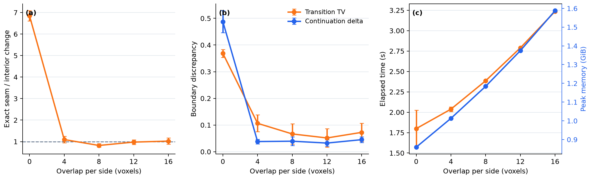

  <h1>Anchor-Conditioned Diffusion for Scalable 3D Microstructure Synthesis</h1>

## Abstract

Three-dimensional microstructures must be large enough to represent pore connectivity and transport, yet volumetric imaging is often more costly than acquiring 2D sections. Matching 2D section distributions alone does not ensure that a specified section appears at a prescribed coordinate, and independently generated blocks can introduce discontinuities when a volume is enlarged. We address these problems with anchor-conditioned diffusion. Rectangular categorical section regions and their coordinates condition the denoiser, constrained voxels receive direct phase supervision, and a three-plane critic regularizes the anchor neighborhood against triplets from unconditioned model samples. In direct 128³ sampling, full-strength labels are clamped into every clean prediction and are exact at the final transition. Scale-up instead uses the resulting volume as a soft state condition, so it may adapt and is never pasted back afterward. Across four seeds, 25% axis-0 coverage produced 95.48 ± 0.03% whole-volume agreement with an in-distribution synthetic reference; 100% coverage is an exact-by-construction sanity check because all voxels are supplied. A 3 × 3 × 3 expansion generated a 384³ volume—27 times the base voxel count—with a mean local pore-continuation difference of −0.36 ± 0.26 percentage points at tile boundaries. In a five-seed ablation, removing overlap raised the exact-boundary phase-change rate to 6.85 ± 0.24 times its interior value, whereas eight-voxel overlap reduced the ratio to 0.82 ± 0.08. These controlled results establish an algorithmic proof of concept, not reconstruction fidelity on unseen experimental 3D material.

## 1. Introduction

Transport and mechanical response depend on three-dimensional morphology, not only on the appearance of individual sections. Digital material studies therefore require volumes that are large enough to contain representative connected paths. Tomography can provide such data, but its cost, resolution, and field of view often make 2D microscopy the more accessible source of microstructural information.

Optimization, adversarial, and diffusion methods can infer statistically plausible 3D structures from one or more 2D images [1–5]. Their usual objective is distributional: generated sections should resemble the observed 2D population. A distributional objective by itself does not guarantee that a particular section is retained at a known coordinate. Inserting that section after generation satisfies the local labels but can break structures on either side of the plane.

Volume size creates a second difficulty. A model trained on small patches cannot directly represent a much larger field of view, whereas generating blocks independently and stitching them afterward leaves no mechanism for reconciling their boundaries. Shared-state diffusion offers a way to couple overlapping predictions during sampling [6].

We combine these ideas in a categorical 3D generator trained without paired 2D–3D data. The method (i) integrates full or rectangular partial plane anchors throughout denoising, with direct label supervision and a three-plane adversarial regularizer; (ii) enlarges volumes by jointly denoising overlapping 3D blocks around a softly conditioned base; and (iii) evaluates coordinate agreement, section distribution, phase fraction, diffusive tortuosity, and tile-boundary continuity separately. This separation is important because a volume can match 2D statistics without matching a controlled target at the same coordinates, or satisfy supplied coordinates while changing global morphology.

## 2. Related Work

### 2.1 Reconstruction from 2D observations

Feature-matching and conditional neural methods reconstruct 3D microstructures from a 2D exemplar [1,2]. SliceGAN removes the need for paired 3D supervision by applying 2D discriminators to sections of a generated volume [3]. Diffusion has also been used for 2D microstructure synthesis [7] and, more recently, for 2D-to-3D dimensional expansion [4,5]. Property-conditioned approaches control quantities such as phase fraction or spatial statistics [8,9]. Recent volumetrically supervised methods additionally condition on fixed or sparse observed slices [10,11]. Our distinct setting uses unregistered 2D section collections rather than volumetric training targets and guarantees full-strength labels only in direct, base-size samples.

### 2.2 Conditioning on known regions

Diffusion inpainting preserves observed pixels while generating their surroundings [12,13]. A specified internal section poses a stricter 3D problem: unknown material lies on both sides, and the generated neighborhood should remain compatible across the plane. We adapt masked conditioning to categorical internal sections and regularize three-plane stacks spanning each anchor; direct anchor-neighborhood evaluation remains future work.

### 2.3 Generation beyond the training size

MultiDiffusion binds overlapping diffusion paths through a shared optimization objective [6], whereas Patch-DM collages features cropped from neighboring patches [14]. GrainPaint applies diffusion inpainting to large microstructures [15]. Our scale-up procedure fuses overlapping clean predictions in one 3D categorical state and adds an adaptive base condition with a cosine-tapered transition shell.

## 3. Method

### 3.1 Task definition

Let $\mathcal{D}_a$ be a set of categorical 2D sections normal to axis $a \in \{0,1,2\}$, with phase labels in $\{0,\ldots,K-1\}$. The axis-specific sets need not be spatially aligned. We learn a generator whose categorical samples

$$
X \in \{0,\ldots,K-1\}^{D \times H \times W}
$$

have sections that match the corresponding 2D distributions. At inference, each anchor supplies either a full plane or one dense rectangular region at a distinct axis/coordinate pair. Multiple planes and axes are supported, but labels at intersecting planes must agree. Voxels outside these regions are sampled stochastically.

### 3.2 2D-supervised 3D diffusion

The generator contains a 3D denoising network $G_\theta(x_{t+1},t,z_t,c)$. Reverse transition $t$ maps noisy state $x_{t+1}$ to $x_t$; the network receives that current state, a per-transition latent vector $z_t$, and optional conditions $c$, and predicts phase logits $\ell_\theta$. These are decoded to the relaxed signed one-hot estimate $\hat{x}_0=2\,\mathrm{softmax}(\ell_\theta)-1$; categorical labels are obtained by a final phase-wise argmax. The model follows the forward–reverse diffusion formulation [16] and the short adversarial reverse process of denoising diffusion GANs [17]. The denoiser uses channel widths 16, 32, 64, and 64, a 128-dimensional conditioning embedding, and a 64-dimensional latent vector that is resampled at every reverse transition.

Because paired 3D targets are unavailable, three 2D critics $C_a$ supervise orthogonal sections. Each critic distinguishes forward-noised real section pairs from pairs sliced from the generated reverse process. A global head evaluates the whole section, and a patch head evaluates fine-scale structure. The generator objective is

$$
\mathcal{L}_{\mathrm{adv}}
=\sum_{a=0}^{2}\left(
\mathcal{L}_{\mathrm{global}}^{(a)}
+\lambda_{\mathrm{local}}\mathcal{L}_{\mathrm{local}}^{(a)}
\right).
$$

This trains a 3D generator through observable 2D distributions; it does not provide measured volumetric supervision.

### 3.3 Plane-anchor conditioning

An anchor contains a dense rectangular array of categorical labels, a plane normal, a coordinate on that axis, and an optional in-plane offset. Anchors at distinct axis/coordinate pairs are assembled into a target tensor $Y$ and binary mask $M$, where $M(v)=1$ marks constrained voxel $v$. Full planes and smaller rectangles use the same representation; intersecting rectangles must assign the same label to their shared voxels.

Define the anchor condition as $c_A=(\mathrm{onehot}(Y)\odot M,M)$. Its masked one-hot labels and mask are projected by a zero-initialized 3D convolution and added to the first denoiser feature map:

$$
h_A=\mathrm{Conv}_{3D}\!\left(
\left[\mathrm{onehot}(Y)\odot M,\;M\right]
\right).
$$

Zero initialization leaves the unconditioned mapping unchanged at the start of training. The anchor is provided at every reverse step, and constrained labels are optimized with masked cross-entropy,

$$
\mathcal{L}_{\mathrm{anchor}}
=-\frac{1}{|M|}\sum_{v:M(v)=1}
\log p_\theta\!\left(Y(v)\mid x_{t+1},t,z_t,c_A\right).
$$

Correct labels alone do not ensure a compatible neighborhood. At the final transition ($t=0$), a separate critic evaluates three-plane stacks that span an anchor along its normal direction and supplies $\mathcal{L}_{\mathrm{conn}}$. Its reference stacks are axis-matched triplets replayed from unconditional generated volumes, so the loss regularizes an anchored neighborhood toward the model's baseline continuation rather than toward measured 3D connectivity.

A separate teacher-volume bank stores volumes generated from real single-plane anchors. After the anchor ramp, a multi-plane teacher condition may sample several mutually registered planes from one stored volume, subject to a density limit, minimum same-axis spacing, and optional mixed axes. Keeping this bank separate from the triplet replay avoids treating unrelated real 2D sections as registered slices of one volume.

At full inference strength, constrained voxels in the initial state are drawn from $q(x_T\mid Y)$ using the initial noise. Before each reverse-posterior update, the clean prediction is clamped to $Y$ on $M$; intermediate constrained states remain stochastic posterior samples. The final transition returns the clamped clean prediction directly, which makes the constrained labels exact without post-generation replacement.

### 3.4 Phase-fraction conditioning and full objective

An optional phase-fraction vector $v\in\Delta^{K-1}$, with $v_k\geq0$ and $\sum_k v_k=1$, specifies the desired composition. Non-negative user inputs are normalized to this simplex before sampling. Its embedding conditions the denoiser, while predicted mean fractions $\hat{p}$ receive

$$
\mathcal{L}_{\mathrm{vf}}=\lVert\hat{p}-v\rVert_1.
$$

At training step $s$, the implemented generator objective is

$$
\mathcal{L}_{G}=\mathcal{L}_{\mathrm{adv}}
+r(s)\left(
\lambda_{\mathrm{anchor}}\mathcal{L}_{\mathrm{anchor}}
+\lambda_{\mathrm{conn}}\mathcal{L}_{\mathrm{conn}}
\right)
+\lambda_{\mathrm{vf}}\mathcal{L}_{\mathrm{vf}},
$$

where $r(s)$ ramps linearly to one over the first 1,000 steps. The connectivity term is active only for anchored samples at the final transition, when anchor-spanning triplets are available. The reported model uses 10 reverse transitions, $\lambda_{\mathrm{local}}=0.5$ inside $\mathcal{L}_{\mathrm{adv}}$, and weights $\lambda_{\mathrm{anchor}}=1$, $\lambda_{\mathrm{conn}}=0.25$, and $\lambda_{\mathrm{vf}}=1$. Independent anchor and phase-fraction dropout probabilities of 0.2 retain unconditioned sampling with the same network.

### 3.5 Shared-state tiled scale-up

Let $P$ be the block core size and $o$ the halo width on each side; the reported model uses $P=128$. Each tile reads a $(P+2o)^3$ field from one shared noisy volume and predicts the full relaxed clean field. At every reverse transition, one newly sampled latent vector $z_t$ is shared by all tiles. A separable cosine-taper window $w_k$ then fuses their overlapping predictions:

$$
\bar{x}_0(v)=
\frac{\sum_k w_k(v)\hat{x}_{0,k}(v)}
{\sum_k w_k(v)}.
$$

The reverse posterior updates the shared global state only after fusion, so adjacent tiles exchange information throughout denoising rather than being stitched after generation. Halo reads that extend beyond the outer output boundary wrap periodically to the opposite side; the method therefore imposes a periodic outer-context assumption. The default halo width is eight voxels per side, giving a 144³ model input around each 128³ core.

When a base volume $B$ is supplied, define its signed one-hot field as $b(v)=2\,\mathrm{onehot}(B(v))-1$ and keep one fixed noise field $\epsilon_B$. The corresponding fixed-noise forward realization is

$$
\widetilde{B}_{t+1}(v)=
\sqrt{\bar{\alpha}_{t+1}}\,b(v)
+\sqrt{1-\bar{\alpha}_{t+1}}\,\epsilon_B(v).
$$

Immediately before reverse transition $t$, the centered shared state is blended as

$$
x_{t+1}(v)\leftarrow[1-s(v)]x_{t+1}(v)
+s(v)\widetilde{B}_{t+1}(v),
$$

where $\bar{\alpha}_{t+1}$ is the cumulative forward signal coefficient and $s(v)=1$ in the base interior, with a separable cosine taper over the four-voxel outer shell. This operation conditions the noisy input state; it does not clamp the tile predictions. Final labels are obtained from the fused clean prediction and are never overwritten by $B$, so even the full-strength base interior may change.

## 4. Experimental Setup

### 4.1 Data and scope

The available source artifact, `data/sample.png`, is a 226 × 690 binary phase map. Phase 0 is treated as pore and phase 1 as solid. The material system, acquisition and segmentation procedures, physical pixel size, and external source or data license are not recorded in the available project files. Results are therefore reported in voxels and should be interpreted as an algorithmic study without a calibrated physical length scale. Under an isotropy assumption, the same image distribution supervises all three axes. Random 128 × 128 crops are used at the real critic-section size and, with probability 0.5, augmented by right-angle rotations and reflections (Figure 1).

  

<em>Figure 1. Binary 2D training image. Orange boxes show example 128 × 128 crops used at the real critic-section size. Black denotes pore and gray denotes solid throughout.</em>

Evaluation uses 64 randomly sampled real crops. A fixed unconditioned 128³ seed-10000 sample from the trained generator serves as synthetic pseudo-ground truth for controlled anchor tests; it is denoted GT only in that context and is not experimental 3D ground truth or a real-material fidelity reference. Evaluation volumes use separate seeds 0–3. All real crops come from the training image, so the study is an in-sample proof of concept rather than a held-out generalization test.

### 4.2 Training and implementation

The evaluated model is the EMA output of a 20,000-step run with decay 0.999.

Each step generates one relaxed 3D volume whose side length is sampled uniformly from 128, 136, 144, 152, or 160 voxels; 16 section pairs per axis are passed to the critics. The real-section loader uses batch size 8. Adam uses learning rates $1.6\times10^{-4}$ for the denoiser and $1.0\times10^{-4}$ for all critics, with $\beta_1=0.5$ and $\beta_2=0.9$. Training uses mixed precision and an R1 penalty with $\gamma=0.2$ every 16 steps. The 10-transition variance-preserving schedule uses continuous rate endpoints $\beta_{\min}=0.1$ and $\beta_{\max}=20$, with $\bar{\alpha}(u)=\exp[-\tfrac{1}{2}(\beta_{\max}-\beta_{\min})u^2-\beta_{\min}u]$ for $u\in[0,1]$. The shared anchor/connectivity ramp reaches one after 1,000 steps; anchor dropout is 0.2, the probability of requesting a multi-plane teacher after the ramp is 0.5, the maximum plane density is 0.05, minimum same-axis spacing is four voxels, and the mixed-axis probability is 0.5.

### 4.3 Evaluation protocols

The single-plane examples in Figures 4 and 6 use the 128 × 128 crop at $(\mathrm{left},\mathrm{top})=(281,58)$ in `data/sample.png`, place it at the axis-0 center of a 128³ volume, and use seed 0. A separate seed-0 coverage sweep supplies 0, 1, 2, 4, 8, 16, 32, 64, or 128 planes from the synthetic GT at evenly distributed axis-0 coordinates. Coordinates are recomputed for each count, so successive sets are not generally nested. The multi-sample evaluation uses 32, 64, 96, and 128 planes—25%, 50%, 75%, and 100% coverage—with seeds 0–3.

The phase-fraction-conditioned samples receive the synthetic reference fractions $(0.3526607,0.6473393)$ as an oracle target. Only this one target is tested.

For each scale-up seed, a new single-plane-anchored 128³ base is generated and centered in a 384³ output. The sampler uses 3 × 3 × 3 block cores with eight-voxel halos. A four-voxel shell on each base face tapers the conditioning strength; no part of the base is pasted into the final volume. Figure 6 uses seed 0. A separate unanchored overlap ablation uses a 2 × 1 × 1 grid, output shape 256 × 128 × 128, overlaps of 0, 4, 8, 12, and 16 voxels per side, and five seeds (20260808–20260812).

### 4.4 Metrics

- **Kernel Inception Distance (KID):** the unbiased squared maximum mean discrepancy between 2,048-dimensional Inception-v3 features [18], using 100 subsets of 50 images. A fixed set of 64 real crops (seed 10000) is compared with either an independently sampled real crop set or 64 axis-0 sections drawn without replacement from each generated volume. All inputs use a 128 × 128 field of view and are repeated into three binary RGB channels. For scale-up, one seeded 128 × 128 crop is taken from each selected section. Lower is better, and the unbiased estimate may be slightly negative.

- **Porosity:** the fraction of pixels or voxels assigned to phase-0 pore. Agreement with the reference value is desired.

- **Tortuosity:** the axis-0 diffusive tortuosity factor of the pore phase, computed with TauFactor 1.2.1 using Dirichlet conditions along axis 0, no-flux transverse boundaries, and convergence criterion $10^{-3}$ [19]. It follows $D_{\mathrm{eff}}=D\varepsilon/\tau$, where $\varepsilon$ is porosity. Comparison with the synthetic reference measures within-model consistency, not agreement with experimental transport.

- **Voxel accuracy:** the fraction of all 128³ voxels whose phase matches the synthetic GT at the same coordinate. This is a whole-volume recovery score, not accuracy restricted to supplied planes.

- **Local pore-continuation drop:** for adjacent planes normal to axis $a$, $C_a=P(X_{i+1}=0\mid X_i=0)$. The reported value is the three-axis mean $\Delta C=C_{\mathrm{interior}}-C_{\mathrm{boundary}}$, excluding pairs within four voxels of each boundary from the interior estimate. Zero indicates no measured boundary effect; a negative value means slightly greater local continuation at the boundary.

- **Overlap diagnostics:** the exact seam-change ratio divides the phase-change rate at the tile boundary by the median of the remaining pair rates; the evaluator's radius-4 exclusion removes the boundary pair together with its four lower-index and five higher-index neighbors. A ratio of one is ideal. For the other diagnostics, the seam-band half-width is $b=\max[1,\min(o,4)]$. Each adjacent-plane pair in that band is compared with a pooled interior distribution, subsampled to at most 64 pairs. Transition TV is the maximum total-variation distance between phase-transition distributions, and continuation delta is the maximum absolute phase-wise continuation difference; lower is better for both.

Unless marked otherwise, Table 1 values are means over four seeded replicates. KID ± is the mean of the four within-replicate sample standard deviations across 100 KID subsets; every other ± value is the between-replicate sample standard deviation. Depending on the row, replicate variation arises from volume sampling, crop selection, and/or section selection. These uncertainties do not cover specimens, datasets, or training runs. The controlled reference is one volume. The real-data KID is a baseline between independently sampled crop sets. Figure 5 is a separate seed-0 diagnostic whose KID is measured against synthetic-GT sections.

## 5. Results

Table 1 separates similarity to real 2D crops from consistency with the synthetic reference. The real-versus-real KID is 0.0004 ± 0.0013, whereas the unconditioned 3D KID is 0.0345 ± 0.0043; this gap shows that generated axis-0 sections do not match the training-image crop features as closely as independently sampled real crops do. Relative to the synthetic reference, unconditioned samples have similar mean porosity (0.3520 versus 0.3527) but lower mean axis-0 tortuosity (1.8843 versus 1.9519). Supplying the reference phase fractions as an oracle target moves mean porosity to 0.3538, increasing its absolute error from 0.0007 to 0.0011, and does not improve KID or tortuosity. A single target therefore does not establish effective phase-fraction control.

| Evaluation data | KID | Porosity | Tortuosity | Voxel accuracy | Local pore-continuation drop |
|---|---:|---:|---:|---:|---:|
| Controlled reference (GT) | — | 0.3527 | 1.9519 | — | — |
| Real 2D crops | 0.0004 ± 0.0013 | 0.3625 ± 0.0042 | — | — | — |
| 3D | 0.0345 ± 0.0043 | 0.3520 ± 0.0033 | 1.8843 ± 0.0586 | — | — |
| 3D (phase-fraction conditioned) | 0.0420 ± 0.0047 | 0.3538 ± 0.0025 | 1.8665 ± 0.0550 | — | — |
| 3D (anchored, 25%) | 0.0452 ± 0.0049 | 0.3470 ± 0.0010 | 2.0559 ± 0.0134 | 95.48 ± 0.03% | — |
| 3D (anchored, 50%) | 0.0604 ± 0.0054 | 0.3561 ± 0.0005 | 1.9446 ± 0.0015 | 98.04 ± 0.01% | — |
| 3D (anchored, 75%) | 0.0496 ± 0.0051 | 0.3525 ± 0.0004 | 1.9453 ± 0.0013 | 99.00 ± 0.01% | — |
| 3D (anchored, 100%) | 0.0418 ± 0.0046 | 0.3527 ± 0.0000 | 1.9519 ± 0.0000 | 100.00 ± 0.00% | — |
| 3D (scale-up) | 0.0171 ± 0.0028 | 0.3482 ± 0.0012 | 1.9191 ± 0.0308 | — | −0.36 ± 0.26 pp |

### 5.1 Three-dimensional synthesis

The cutaway in Figure 2 exposes both the surface and interior of the fixed 128³ controlled-reference volume. Its three orthogonal center sections (Figure 3) show feature scales comparable to those in the training image. These figures provide qualitative context; Table 1 supplies the distributional and transport measurements.

  

<em>Figure 2. Generated 128³ controlled-reference volume with one octant removed. Black denotes pore and gray denotes solid.</em>

  

<em>Figure 3. Center sections normal to axes 0, 1, and 2 of the volume in Figure 2.</em>

### 5.2 Plane anchoring

In the seed-0 single-plane example, the generated center section matches all 16,384 supplied voxels without post-generation replacement (Figure 4). Because the final clean prediction is clamped on the mask, this confirms the sampler invariant rather than learned reconstruction accuracy. It is also distinct from the whole-volume agreement reported for partial coverage in Table 1.

  

<em>Figure 4. Fixed-seed single-plane conditioning. (a) Supplied axis-0 center section; (b) generated section, matching 16,384/16,384 constrained voxels; (c) surrounding 128³ volume.</em>

Across four seeds, whole-volume agreement is 95.48 ± 0.03% at 25% coverage, 98.04 ± 0.01% at 50%, and 99.00 ± 0.01% at 75%. Supplying all 128 axis-0 planes covers every voxel and therefore gives 100% by construction. The seed-0 sweep in Figure 5 shows the corresponding association with denser evenly spaced coverage: 54.64% at zero planes, 95.45% at 32 planes, 98.04% at 64 planes, and the exact full-coverage endpoint. Because each count recomputes its coordinates, this is not a nested sequence of constraints. Porosity, tortuosity, and KID are not monotonic because they measure aggregate or distributional properties rather than coordinate-wise identity.

  

<em>Figure 5. Fixed-seed controlled-reference diagnostic for 0–128 supplied axis-0 planes. (a) Accuracy is measured over the complete 128³ volume. (b) KID compares all generated axis-0 sections with synthetic-GT sections and is not directly comparable with Table 1; its unbiased finite-sample estimate can be slightly negative. Dashed lines in (c,d) show GT porosity and tortuosity. The symmetric-log x-axis separates low anchor counts; no across-volume uncertainty is shown because the seed is fixed.</em>

### 5.3 Anchored scale-up

The shared-state sampler expands the 128³ base to 384³. In the illustrated seed-0 center plane, the complete 128 × 128 anchor retains 16,173 of 16,384 voxels (98.71%) after scale-up. The 120 × 120 full-strength conditioning interior retains 14,385 of 14,400 voxels (99.90%), and the corresponding 120³ base interior retains 1,727,536 of 1,728,000 voxels (99.97%). These are conditioning outcomes rather than exact constraints or post-generation replacement. Across four samples, the mean local pore-continuation difference at tile boundaries is −0.36 ± 0.26 percentage points. The sample mean does not indicate reduced adjacent-pore continuation, but no equivalence test was performed and this metric does not establish topological or transport continuity.

  

<em>Figure 6. Scale-up with 3 × 3 × 3 block cores and eight-voxel overlap. (a) 128² center-plane anchor; (b) 384² center section, with the orange box marking the full 128² base footprint and the blue dashed box marking the 120² full-strength conditioning region; (c) cutaway of the 384³ output. No base voxels are pasted into the result.</em>

### 5.4 Overlap ablation

Table 2 isolates one tile boundary in a 256 × 128 × 128 unanchored scale-up and reports mean ± sample standard deviation over five seeds. Without overlap, the exact-boundary phase-change rate is 6.85 ± 0.24 times the interior rate, transition TV is 0.369 ± 0.015, and continuation delta is 0.488 ± 0.041. Four voxels remove most of the discrepancy. Eight voxels further lower transition TV from 0.106 to 0.067 while leaving continuation delta essentially unchanged (0.038 versus 0.039); 12 voxels gives the lowest mean TV and continuation delta at additional cost, whereas 16 gives no consistent improvement. The exact seam ratio at eight voxels is below one, indicating a slightly smoother exact boundary than the median interior pair for this diagnostic.

| Overlap per side | Exact seam-change ratio | Transition TV | Continuation delta | Time | Peak GPU memory |
|---:|---:|---:|---:|---:|---:|
| 0 | 6.85 ± 0.24 | 0.369 ± 0.015 | 0.488 ± 0.041 | 1.80 ± 0.23 s | 0.859 ± 0.000 GiB |
| 4 | 1.10 ± 0.15 | 0.106 ± 0.032 | 0.038 ± 0.009 | 2.04 ± 0.03 s | 1.013 ± 0.000 GiB |
| 8 | 0.82 ± 0.08 | 0.067 ± 0.038 | 0.039 ± 0.017 | 2.385 ± 0.004 s | 1.184 ± 0.000 GiB |
| 12 | 0.98 ± 0.11 | 0.052 ± 0.035 | 0.032 ± 0.012 | 2.789 ± 0.006 s | 1.374 ± 0.000 GiB |
| 16 | 1.02 ± 0.15 | 0.073 ± 0.034 | 0.045 ± 0.011 | 3.236 ± 0.008 s | 1.588 ± 0.000 GiB |

  

<em>Figure 7. Five-seed overlap ablation on a 256 × 128 × 128 output; error bars show sample standard deviations. (a) Exact seam phase-change rate relative to the median interior rate; the dashed line marks one. (b) Maximum transition-distribution and phase-continuation discrepancies within the seam band; lower is better. (c) Elapsed generation time and peak allocated GPU memory on an RTX 2060.</em>

## 6. Discussion

Plane anchors change the direct-sampling task from statistical synthesis to coordinate-aware conditional synthesis. In the controlled same-model experiment, higher evenly spaced coverage is associated with greater whole-volume agreement even though KID is not monotonic. The coordinate sets are not nested, however, and the target is sampled from the same generator, so the sweep does not establish reconstruction of an unseen experimental volume. KID asks whether an unordered set of sections has a similar feature distribution, whereas voxel agreement asks whether this synthetic target appears at the same coordinates.

The morphology metrics reveal a second distinction. Porosity depends only on phase count and is relatively stable; tortuosity depends on connected transport paths and varies more under sparse anchoring. Full coverage reproduces the controlled reference exactly because every voxel is clamped, while partial coverage does not move aggregate properties monotonically toward it. The single oracle phase-fraction test also fails to improve porosity error, KID, or tortuosity. These results support spatial conditioning in the controlled setting, but not general composition control or physical-property recovery.

Joint tiled denoising produces a 27-fold increase in voxel count while keeping a supplied base highly represented without copying it into the result. The sample mean is negative, so no reduction in adjacent-pore continuation is observed in this statistic for the four tested samples; this remains neither an equivalence test nor a topology result. In the two-tile unanchored ablation, overlap provides the spatial communication that a shared latent vector and global storage do not provide at zero overlap. Eight voxels are retained as a pragmatic default: 12 gives somewhat lower mean discrepancy at higher cost, while increasing from 8 to 16 raises elapsed time by 36% and peak allocated memory by 34% without a consistent quality gain. This tradeoff is specific to the tested model, boundary, periodic outer context, and hardware.

## 7. Limitations

The synthetic GT is sampled from the trained model and therefore lies within its learned distribution. It tests controlled coordinate agreement, not reconstruction of unseen experimental 3D material. The real crop baseline, training data, and single-plane anchor all come from the same 2D image, with no held-out specimen. The image's material provenance, imaging and segmentation history, physical scale, and external license are unavailable.

The anchor study verifies exact supplied labels and whole-volume agreement, but it does not measure continuity normal to anchor planes, compare with a slice-conditioned baseline, or ablate the anchor input, anchor loss, or connectivity critic. Because the connectivity critic's reference triplets are themselves unconditioned model samples, its contribution to physical connectivity cannot be inferred from the present results. Exact full-coverage agreement is an algorithmic consequence of clamping, not evidence for the learned regularizer.

The principal quantitative comparisons use only four seeded replicates, one binary image, an isotropy assumption, and axis-0 anchors and tortuosity. The phase-fraction study uses one oracle target. The overlap sweep uses five seeds but isolates one axis and one boundary, and the sampler assumes periodic outer context; runtime and memory values are hardware-specific. Multi-axis or intersecting-anchor evaluation, anisotropic and multiphase media, independent training runs, and experimental volumes remain untested. Voxel accuracy is phase-imbalance sensitive, while KID uses natural-image features and may miss material-specific morphology. Finally, local pore continuation measures only adjacent-voxel agreement; connected components, percolation, permeability, and direct anchor-neighborhood metrics are needed for stronger physical validation.

## 8. Conclusion

This work integrates exact full-strength anchors for direct base-size sampling with shared-state tiled diffusion in a 2D-supervised categorical 3D generator. In the same-model controlled experiment, 25% axis-0 coverage yields 95.48 ± 0.03% whole-volume agreement; the 100% endpoint is exact by construction. Tiled sampling expands the volume 27-fold, lets a supplied base adapt, and yields a mean local continuation difference of −0.36 ± 0.26 percentage points across four samples. A two-tile ablation supports eight-voxel overlap as a practical quality–cost choice for this 128³-core model, not as a universal optimum. The method is a proof of concept for retaining specified 2D phase information inside larger stochastic volumes. Held-out experimental data, direct anchor-neighborhood validation, component baselines, and a complete reproducibility archive are required before making reconstruction or physical-fidelity claims.

## References

[1] R. Bostanabad, “Reconstruction of 3D microstructures from 2D images via transfer learning,” *Computer-Aided Design*, vol. 128, art. 102906, 2020.

[2] J. Feng, Q. Teng, B. Li, X. He, H. Chen, and Y. Li, “An end-to-end three-dimensional reconstruction framework of porous media from a single two-dimensional image based on deep learning,” *Computer Methods in Applied Mechanics and Engineering*, vol. 368, art. 113043, 2020.

[3] S. Kench and S. J. Cooper, “Generating three-dimensional structures from a two-dimensional slice with generative adversarial network-based dimensionality expansion,” *Nature Machine Intelligence*, vol. 3, pp. 299–305, 2021.

[4] J. Phan et al., “Generating 3D images of material microstructures from a single 2D image: a denoising diffusion approach,” *Scientific Reports*, vol. 14, art. 6498, 2024.

[5] K.-H. Lee and G. J. Yun, “Multi-plane denoising diffusion-based dimensionality expansion for 2D-to-3D reconstruction of microstructures with harmonized sampling,” *npj Computational Materials*, vol. 10, art. 99, 2024.

[6] O. Bar-Tal, L. Yariv, Y. Lipman, and T. Dekel, “MultiDiffusion: Fusing diffusion paths for controlled image generation,” in *Proceedings of the 40th International Conference on Machine Learning*, vol. 202, pp. 1737–1752, 2023.

[7] C. Düreth, P. Seibert, D. Rücker, S. Handford, M. Kästner, and M. Gude, “Conditional diffusion-based microstructure reconstruction,” *Materials Today Communications*, vol. 35, art. 105608, 2023.

[8] A. Sadeghkhani, B. Bennett, and A. Rabbani, “Property-constrained 3D porous media reconstruction from 2D images via conditional generative adversarial networks,” in *87th EAGE Annual Conference & Exhibition*, vol. 2026, pp. 1–5, 2026.

[9] Z. Ma et al., “A sliced-Wasserstein and neural network framework for statistically controllable 3D microstructure reconstruction,” *Computer-Aided Design*, vol. 198, art. 104100, 2026.

[10] S. Fan, Y. Li, X. Wang, and D. Du, “Dual-domain latent diffusion framework with multi-modal conditioning for controllable porous media reconstruction,” *Computational Materials Science*, vol. 272, art. 114876, 2026.

[11] Y. Shi et al., “GeoTopoDiff: Learning geometry–topology graph priors through boundary-constrained mixed diffusion for sparse-slice 3D porous reconstruction,” *arXiv preprint* arXiv:2605.03764, 2026.

[12] G. Zhang et al., “Towards coherent image inpainting using denoising diffusion implicit models,” in *Proceedings of the 40th International Conference on Machine Learning*, vol. 202, pp. 41164–41193, 2023.

[13] A. Lugmayr et al., “RePaint: Inpainting using denoising diffusion probabilistic models,” in *Proceedings of the IEEE/CVF Conference on Computer Vision and Pattern Recognition*, pp. 11461–11471, 2022.

[14] Z. Ding, M. Zhang, J. Wu, and Z. Tu, “Patched denoising diffusion models for high-resolution image synthesis,” in *International Conference on Learning Representations*, 2024.

[15] N. Hoffman, C. Diniz, D. Liu, T. M. Rodgers, A. Tran, and M. D. Fuge, “GrainPaint: A multi-scale diffusion-based generative model for microstructure reconstruction of large-scale objects,” *Acta Materialia*, vol. 288, art. 120784, 2025.

[16] J. Ho, A. Jain, and P. Abbeel, “Denoising diffusion probabilistic models,” in *Advances in Neural Information Processing Systems*, vol. 33, pp. 6840–6851, 2020.

[17] Z. Xiao, K. Kreis, and A. Vahdat, “Tackling the generative learning trilemma with denoising diffusion GANs,” in *International Conference on Learning Representations*, 2022.

[18] M. Bińkowski, D. J. Sutherland, M. Arbel, and A. Gretton, “Demystifying MMD GANs,” in *International Conference on Learning Representations*, 2018.

[19] S. J. Cooper, A. Bertei, P. R. Shearing, J. A. Kilner, and N. P. Brandon, “TauFactor: An open-source application for calculating tortuosity factors from tomographic data,” *SoftwareX*, vol. 5, pp. 203–210, 2016.
