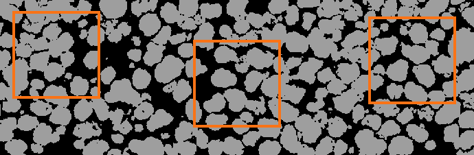
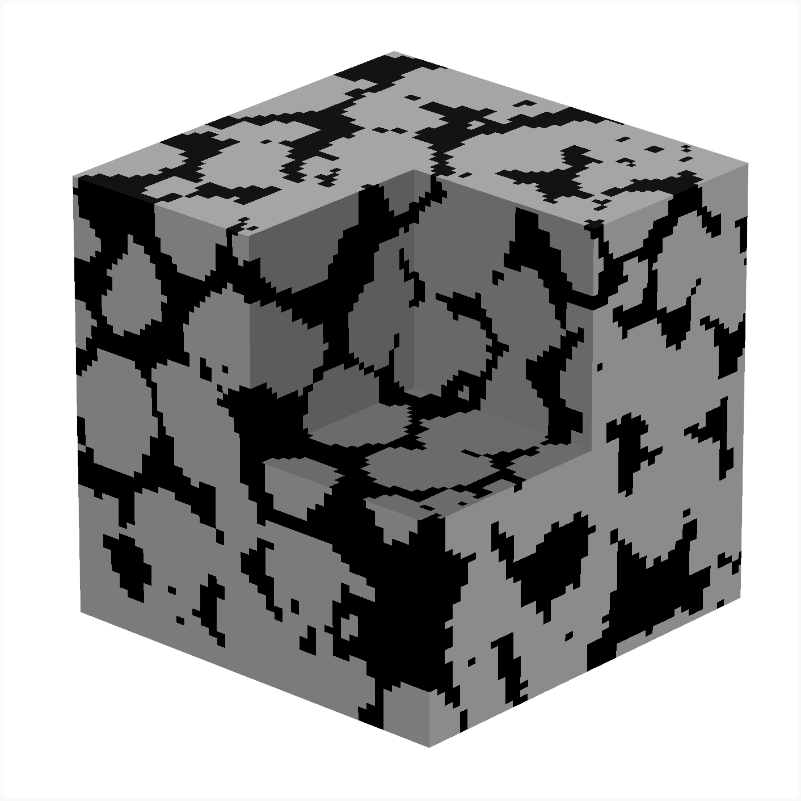
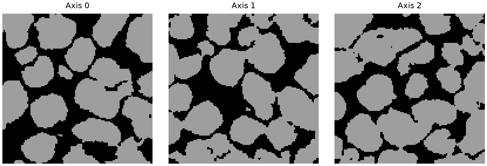
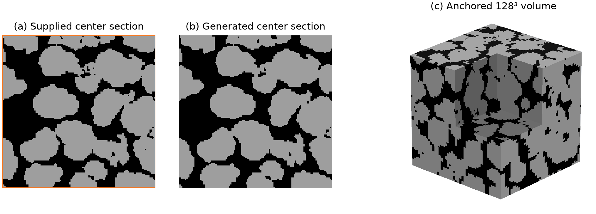
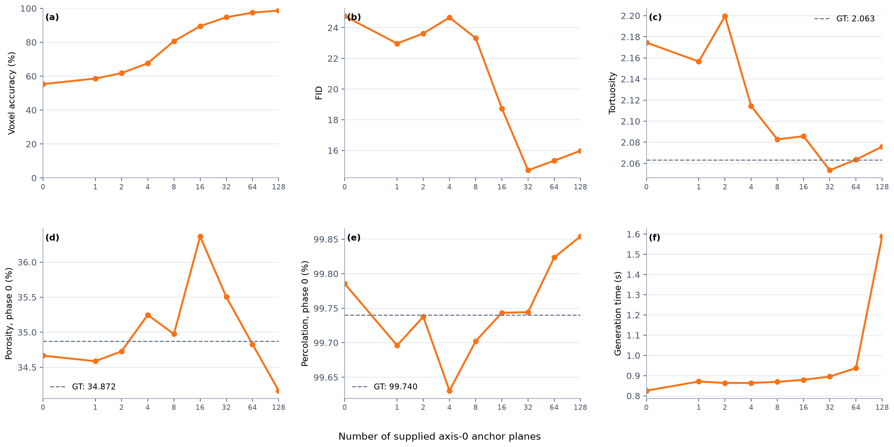
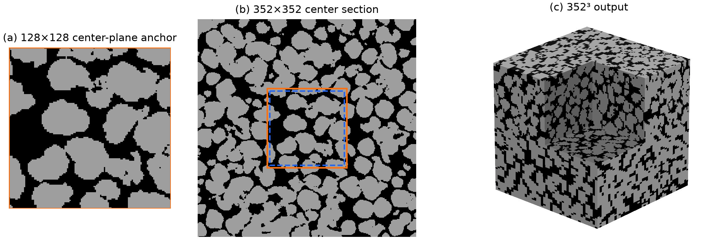
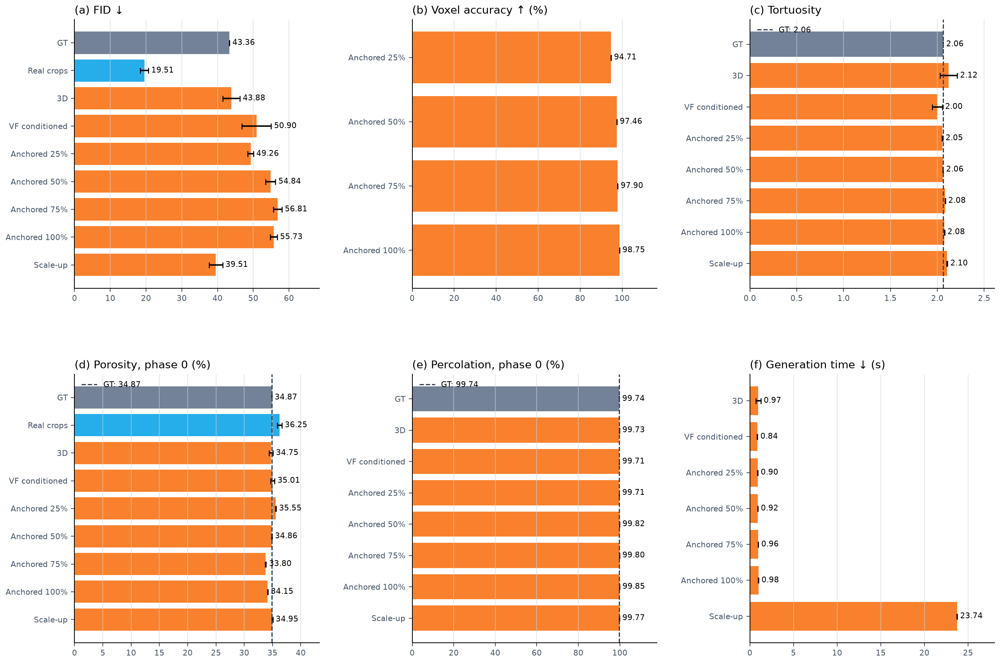

  <h1>Anchor-Conditioned Diffusion for Scalable 3D Microstructure Synthesis</h1>

## Abstract

We generate binary 3D microstructures from a 2D image and optionally tell the model which internal sections should appear at specific coordinates. The supplied sections are used as learned conditions; they are not pasted into the final volume. The same 128³ model is also used to build a larger 352³ volume from overlapping fixed-size blocks. On a controlled synthetic reference, 25% and 100% anchor coverage give 94.71 ± 0.03% and 98.75 ± 0.02% whole-volume voxel accuracy. The 352³ scale-up has FID 39.51 ± 1.90, phase-0 porosity 0.3495 ± 0.0011, tortuosity 2.1030 ± 0.0048, phase-0 percolation 0.9977 ± 0.0002, and generation time 23.74 ± 0.02 s. These results come from one binary training image and a same-model synthetic reference, so they demonstrate controlled behavior rather than experimental 3D reconstruction accuracy.

## 1. Introduction

Many material properties depend on connected paths through a 3D structure. However, 2D microscopy is often easier to obtain than a large 3D scan. This motivates models that learn from 2D sections and generate 3D volumes.

Matching the overall 2D appearance is not enough when a known section must appear at a particular 3D coordinate. Pasting the section after generation would match its labels exactly, but it could create an unnatural neighborhood around the plane. We instead condition the model on the section during sampling.

A second problem is size. A network trained on 128³ inputs cannot directly process a much larger volume. Independent blocks also tend to leave visible boundaries. Our scale-up sampler keeps the block size fixed at 128³, overlaps only neighboring blocks, and fuses their predictions during every diffusion step.

The paper focuses on three questions: whether generated sections resemble the 2D data, whether supplied anchors are recovered at the right coordinates, and whether the same model can generate a larger volume. We report six direct measurements: FID, voxel accuracy, tortuosity, phase-0 porosity, phase-0 percolation, and generation time.

## 2. Related Work

### 2.1 Reconstruction from 2D observations

Feature-matching and conditional neural methods reconstruct 3D microstructures from a 2D exemplar [1,2]. SliceGAN removes the need for paired 3D supervision by applying 2D discriminators to sections of a generated volume [3]. Diffusion has also been used for 2D microstructure synthesis [7] and, more recently, for 2D-to-3D dimensional expansion [4,5]. Property-conditioned approaches control quantities such as phase fraction or spatial statistics [8,9]. Recent volumetrically supervised methods additionally condition on fixed or sparse observed slices [10,11]. Our distinct setting uses unregistered 2D section collections rather than volumetric training targets and treats supplied internal sections as learned conditions in direct, base-size samples.

### 2.2 Conditioning on known regions

Diffusion inpainting preserves observed pixels while generating their surroundings [12,13]. A specified internal section poses a stricter 3D problem: unknown material lies on both sides, and the generated neighborhood should remain compatible across the plane. We adapt masked conditioning to categorical internal sections and regularize three-plane stacks spanning each anchor; direct anchor-neighborhood evaluation remains future work.

### 2.3 Generation beyond the training size

MultiDiffusion binds overlapping diffusion paths through a shared optimization objective [6], whereas Patch-DM collages features cropped from neighboring patches [14]. GrainPaint applies diffusion inpainting to large microstructures [15]. Our scale-up procedure fuses overlapping clean predictions in one 3D categorical state and adds an adaptive base condition with a cosine-tapered transition shell.

## 3. Method

### 3.1 Task definition

Let $\mathcal{D}_a$ be a set of categorical 2D sections normal to axis $a \in \{0,1,2\}$, with phase labels in $\{0,\ldots,K-1\}$. The axis-specific sets need not be spatially aligned. We learn a generator whose categorical samples

$$
X \in \{0,\ldots,K-1\}^{D \times H \times W}
$$

have sections that match the corresponding 2D distributions. At inference, each anchor supplies either a full plane or one dense rectangular region at a distinct axis/coordinate pair. Multiple planes and axes are supported, but labels at intersecting planes must agree. Voxels outside these regions are sampled stochastically.

### 3.2 2D-supervised 3D diffusion

The generator contains a 3D denoising network $G_\theta(x_{t+1},t,z_t,d,c)$, where $d$ is the domain ID. Reverse transition $t$ maps noisy state $x_{t+1}$ to $x_t$; the network receives that current state, a per-transition latent vector $z_t$, and optional conditions $c$, and predicts phase logits $\ell_\theta$. These are decoded to the relaxed signed one-hot estimate $\hat{x}_0=2\,\mathrm{softmax}(\ell_\theta)-1$; categorical labels are obtained by a final phase-wise argmax. The model follows the forward–reverse diffusion formulation [16] and the short adversarial reverse process of denoising diffusion GANs [17]. The denoiser uses channel widths 16, 32, 64, and 64, a 128-dimensional conditioning embedding, and a 64-dimensional latent vector that is resampled at every reverse transition.
The denoiser and critics also receive a numeric domain ID. This keeps configured datasets separate in multi-domain training; the evaluated run contains only domain 0.

Because paired 3D targets are unavailable, three domain-conditioned 2D critics $C_a$ supervise orthogonal sections. Each critic compares real section pairs with pairs cut from generated volumes. A global head evaluates the whole section, and a patch head evaluates local structure. The generator objective is

$$
\mathcal{L}_{\mathrm{adv}}
=\sum_{a=0}^{2}\left(
\mathcal{L}_{\mathrm{global}}^{(a)}
+\lambda_{\mathrm{local}}\mathcal{L}_{\mathrm{local}}^{(a)}
\right).
$$

This trains a 3D generator through observable 2D distributions; it does not provide measured volumetric supervision.

### 3.3 Plane-anchor conditioning

An anchor contains a dense rectangular array of categorical labels, a plane normal, a coordinate on that axis, and an optional in-plane offset. Anchors at distinct axis/coordinate pairs are assembled into a target tensor $Y$ and binary mask $M$, where $M(v)=1$ marks constrained voxel $v$. Full planes and smaller rectangles use the same representation; intersecting rectangles must assign the same label to their shared voxels.

Define the anchor condition as $c_A=(\mathrm{onehot}(Y)\odot M,M)$. Its masked one-hot labels and mask are projected by a zero-initialized 3D convolution and added to the first denoiser feature map:

$$
h_A=\mathrm{Conv}_{3D}\!\left(
\left[\mathrm{onehot}(Y)\odot M,\;M\right]
\right).
$$

Zero initialization leaves the unconditioned mapping unchanged at the start of training. The anchor is provided at every reverse step, and constrained labels are optimized with masked cross-entropy,

$$
\mathcal{L}_{\mathrm{anchor}}
=-\frac{1}{|M|}\sum_{v:M(v)=1}
\log p_\theta\!\left(Y(v)\mid x_{t+1},t,z_t,c_A\right).
$$

Correct labels alone do not ensure a compatible neighborhood. At the final transition ($t=0$), a separate critic evaluates three-plane stacks that span an anchor along its normal direction and supplies $\mathcal{L}_{\mathrm{conn}}$. Its reference stacks are axis-matched triplets replayed from unconditional generated volumes, so the loss regularizes an anchored neighborhood toward the model's baseline continuation rather than toward measured 3D connectivity.

A separate teacher-volume bank stores volumes generated from real single-plane anchors. After the anchor ramp, a multi-plane teacher condition may sample several mutually registered planes from one stored volume, subject to a density limit, minimum same-axis spacing, and optional mixed axes. Keeping this bank separate from the triplet replay avoids treating unrelated real 2D sections as registered slices of one volume.

At inference, $c_A$ is supplied to the denoiser at every reverse transition with a user-controlled strength. Sampling starts from the same ordinary noise state as unconditioned generation, applies the standard reverse posterior, and returns a phase-wise argmax after the final transition. The sampler does not initialize constrained voxels from $q(x_T\mid Y)$, clamp intermediate clean predictions, or overwrite final labels. Anchor agreement is therefore a measured learned-conditioning outcome rather than a sampler invariant.

### 3.4 Phase-fraction conditioning and training objective

An optional phase-fraction vector $v\in\Delta^{K-1}$, with $v_k\geq0$ and $\sum_k v_k=1$, specifies the desired composition. Non-negative user inputs are normalized to this simplex before sampling. Its embedding conditions the denoiser, while predicted mean fractions $\hat{p}$ receive

$$
\mathcal{L}_{\mathrm{vf}}=\frac{1}{2}\sum_{k=0}^{K-1}|\hat{p}_k-v_k|.
$$

At training step $s$, the implemented generator objective is

$$
\mathcal{L}_{G}=\mathcal{L}_{\mathrm{adv}}
+r_A(s)\left(
\lambda_{\mathrm{anchor}}\mathcal{L}_{\mathrm{anchor}}
+\lambda_{\mathrm{conn}}\mathcal{L}_{\mathrm{conn}}
+\lambda_{\mathrm{normal}}\mathcal{L}_{\mathrm{normal}}
\right)
+\lambda_{\mathrm{vf}}\mathcal{L}_{\mathrm{vf}}
$$

where unavailable conditional terms are zero. The anchor ramp $r_A$ starts at step 3,000 and reaches one after 6,000 additional steps. The connectivity critic term is active only for anchored final-transition samples. On the same matched anchor triplets, $\mathcal{L}_{\mathrm{normal}}$ compares soft center-to-previous and center-to-next $K\times K$ phase-transition matrices with total-variation distance. The implementation uses 10 reverse transitions, $\lambda_{\mathrm{local}}=0.5$ inside $\mathcal{L}_{\mathrm{adv}}$, and weights $\lambda_{\mathrm{anchor}}=1$, $\lambda_{\mathrm{conn}}=0.25$, $\lambda_{\mathrm{normal}}=0.10$, and $\lambda_{\mathrm{vf}}=1$.

Anchor conditions are requested for 80% of eligible training samples. When anchor and phase-fraction conditions are both available, the joint-null, anchor-null-only, and phase-fraction-null-only states are mutually exclusive and each occurs with probability 0.05; both conditions are retained for the remaining 0.85. When no anchor is present, the lone phase-fraction condition is dropped with probability 0.10. This supplies unconditional and partially conditional states to the same network without independent 0.2 dropouts.

### 3.5 Fixed-block shared-state tiled scale-up

Let $P=128$ be the fixed block input size and $o$ the margin reserved inside each block on every shared face. Adjacent blocks start $P-2o$ voxels apart, so their predictions share a $2o$-voxel fusion band. For $b$ blocks, the output length is $P+(b-1)(P-2o)$. Every denoiser call therefore uses the same $P^3$ shape seen during training. At every reverse transition, one newly sampled latent vector $z_t$ is shared by all blocks. A separable cosine-taper window $w_k$ then fuses their overlapping predictions:

$$
\bar{x}_0(v)=
\frac{\sum_k w_k(v)\hat{x}_{0,k}(v)}
{\sum_k w_k(v)}.
$$

The reverse posterior updates the shared global state only after fusion, so adjacent blocks exchange information throughout denoising rather than being stitched after generation. Margins exist only on faces shared by blocks. Outermost faces use unit weight and receive no padding, external halo, or periodic wrap.

When a base volume $B$ is supplied, define its signed one-hot field as $b(v)=2\,\mathrm{onehot}(B(v))-1$ and keep one fixed noise field $\epsilon_B$. The corresponding fixed-noise forward realization is

$$
\widetilde{B}_{t+1}(v)=
\sqrt{\bar{\alpha}_{t+1}}\,b(v)
+\sqrt{1-\bar{\alpha}_{t+1}}\,\epsilon_B(v).
$$

Immediately before reverse transition $t$, the centered shared state is blended as

$$
x_{t+1}(v)\leftarrow[1-s(v)]x_{t+1}(v)
+s(v)\widetilde{B}_{t+1}(v),
$$

where $\bar{\alpha}_{t+1}$ is the cumulative forward signal coefficient and $s(v)=1$ in the base interior, with a separable cosine taper over the four-voxel outer shell. This operation conditions the noisy input state; it does not clamp the tile predictions. Final labels are obtained from the fused clean prediction and are never overwritten by $B$, so even the full-strength base interior may change.

## 4. Experimental Setup

### 4.1 Data and scope

The available source artifact, `data/sample.png`, is a 226 × 690 binary phase map. Phase 0 is treated as pore and phase 1 as solid. The material system, acquisition and segmentation procedures, physical pixel size, and external source or data license are not recorded in the available project files. Results are therefore reported in voxels and should be interpreted as an algorithmic study without a calibrated physical length scale. Under an isotropy assumption, the same image distribution supervises all three axes. Random 128 × 128 crops are used at the real critic-section size and, with probability 0.5, augmented by right-angle rotations and reflections (Figure 1).

  

<em>Figure 1. Binary 2D training image. Orange boxes show example 128 × 128 crops used at the real critic-section size. Black denotes pore and gray denotes solid throughout.</em>

Evaluation uses 64 randomly sampled real crops. A fixed unconditioned 128³ seed-10000 sample from the trained generator serves as synthetic pseudo-ground truth for controlled anchor tests; it is denoted GT only in that context. Evaluation volumes use separate seeds 0–3. All real crops come from the training image, and no held-out experimental 3D volume is included.

### 4.2 Training and implementation

All reported results use the immutable 20,000-step EMA checkpoint from run 08111303, domain 0, with guidance scale 1.0.

Training always used 128³ volumes, 16 section pairs per axis, and real-section batch size 8. Adam learning rates were $1.6\times10^{-4}$ for the denoiser and $1.0\times10^{-4}$ for the critics. Training used mixed precision, EMA decay 0.999, 10 diffusion transitions, and an R1 penalty every 16 steps. Anchor conditioning started at step 3,000 and ramped for 6,000 steps. Anchors were requested on 80% of eligible steps, and multi-plane teacher conditions were sampled after the ramp. The fixed-block sampler is an inference procedure and does not require a second model.

### 4.3 Evaluation protocols

The single-plane examples in Figures 4 and 6 use the 128 × 128 crop at $(\mathrm{left},\mathrm{top})=(281,58)$ in `data/sample.png`, place it at the axis-0 center of a 128³ volume, and use seed 0. A separate seed-0 coverage sweep supplies 0, 1, 2, 4, 8, 16, 32, 64, or 128 planes from the synthetic GT at evenly distributed axis-0 coordinates. Coordinates are recomputed for each count, so successive sets are not generally nested. The multi-sample evaluation uses 32, 64, 96, and 128 planes—25%, 50%, 75%, and 100% coverage—with seeds 0–3.

The phase-fraction-conditioned samples receive the synthetic reference fractions $(0.3487196,0.6512804)$ as an oracle target. Only this one target is tested.

The scale-up evaluation uses 3 × 3 × 3 fixed 128³ blocks with eight-voxel inward margins. It produces a 352³ volume with shared boundaries at coordinates 120 and 232 on every axis.

### 4.4 Metrics

- **FID:** compares Inception-v3 features from 64 fixed real crops with 64 axis-0 sections from each generated volume [19]. Lower is better. Large scale-up sections are cropped to the same 128 × 128 field of view, so every condition is compared at the same image size.
  Figure 5 instead uses all 128 synthetic-GT axis-0 sections as its FID reference, so its values should not be compared numerically with Table 1.

- **Voxel accuracy:** measures the fraction of voxels that match the synthetic GT at the same coordinates. It is meaningful only for the controlled anchor experiments. Higher is better.

- **Tortuosity:** measures axis-0 diffusive path length through phase 0 with TauFactor 1.2.1 and convergence criterion $10^{-3}$ [18]. The GT value is a reference line; closer is better.

- **Porosity (phase 0):** is the fraction of voxels labeled as phase 0. The GT value is the target for the controlled comparison.

- **Percolation (phase 0):** uses non-periodic 6-connectivity. For each axis, it measures the fraction of phase-0 voxels that belong to a component touching both opposing faces. We report the mean over the three axes. Higher values indicate that more pore voxels belong to spanning paths.

- **Generation time:** is CUDA-synchronized sampling time on an RTX 2060. It includes all model sampling needed for the output, including base generation for scale-up, but excludes TIFF writing and metric calculation. Lower is better.

Table 1 reports mean ± sample standard deviation over four seeds. The GT row is one fixed synthetic volume. Figure 5 is a separate seed-0 anchor sweep and therefore has no error bars.

## 5. Results

Table 1 and Figure 7 show the same six measurements. The real-crop row is the expected low-FID baseline because both crop sets come from the same 2D image. Among generated conditions, scale-up has the lowest FID (39.51 ± 1.90). Its porosity, tortuosity, and percolation remain close to the 128³ GT values, while generation time increases from about one second for a 128³ sample to 23.74 s for a 352³ sample.

| Evaluation data | FID ↓ | Voxel accuracy ↑ | Tortuosity | Porosity (phase 0) | Percolation (phase 0) ↑ | Time ↓ |
|---|---:|---:|---:|---:|---:|---:|
| Controlled reference (GT) | 43.36 | — | 2.0633 | 0.3487 | 99.740% | — |
| Real 2D crops | 19.51 ± 1.14 | — | — | 0.3625 ± 0.0042 | — | — |
| 3D | 43.88 ± 2.37 | — | 2.1211 ± 0.0909 | 0.3475 ± 0.0034 | 99.729 ± 0.064% | 0.972 ± 0.284 s |
| 3D (phase-fraction conditioned) | 50.90 ± 4.10 | — | 1.9993 ± 0.0531 | 0.3501 ± 0.0036 | 99.706 ± 0.048% | 0.844 ± 0.032 s |
| 3D (anchored, 25%) | 49.26 ± 0.79 | 94.71 ± 0.03% | 2.0528 ± 0.0033 | 0.3555 ± 0.0009 | 99.715 ± 0.029% | 0.899 ± 0.015 s |
| 3D (anchored, 50%) | 54.84 ± 1.38 | 97.46 ± 0.01% | 2.0596 ± 0.0028 | 0.3486 ± 0.0006 | 99.819 ± 0.003% | 0.922 ± 0.006 s |
| 3D (anchored, 75%) | 56.81 ± 1.21 | 97.90 ± 0.02% | 2.0834 ± 0.0020 | 0.3380 ± 0.0007 | 99.797 ± 0.008% | 0.957 ± 0.015 s |
| 3D (anchored, 100%) | 55.73 ± 0.97 | 98.75 ± 0.02% | 2.0755 ± 0.0015 | 0.3415 ± 0.0005 | 99.852 ± 0.005% | 0.985 ± 0.015 s |
| 3D (scale-up) | 39.51 ± 1.90 | — | 2.1030 ± 0.0048 | 0.3495 ± 0.0011 | 99.767 ± 0.021% | 23.736 ± 0.022 s |

### 5.1 Three-dimensional synthesis

The cutaway in Figure 2 exposes both the surface and interior of the fixed 128³ controlled-reference volume. Its three orthogonal center sections (Figure 3) show feature scales comparable to those in the training image. These figures provide qualitative context; Table 1 supplies the distributional and transport measurements.

  

<em>Figure 2. Generated 128³ controlled-reference volume with one octant removed. Black denotes pore and gray denotes solid.</em>

  

<em>Figure 3. Center sections normal to axes 0, 1, and 2 of the volume in Figure 2.</em>

### 5.2 Plane anchoring

In the seed-0 single-plane example, the generated center section matches 16,235 of 16,384 supplied voxels (99.09%) without post-generation replacement (Figure 4). This is measured conditioning accuracy, not a hard copy operation.

  

<em>Figure 4. Fixed-seed single-plane conditioning. (a) Supplied axis-0 center section; (b) generated center section, matching 16,235/16,384 constrained voxels (99.09%); (c) surrounding 128³ volume.</em>

Across four seeds, whole-volume accuracy rises from 94.71 ± 0.03% at 25% coverage to 98.75 ± 0.02% at 100% coverage. In the seed-0 sweep, accuracy is 55.33% with no anchors, 94.75% with 32 planes, 97.44% with 64 planes, and 98.72% with 128 planes. FID is lowest at 32 planes (14.71) and remains 15.98 at full coverage, so better coordinate recovery does not require a monotonic FID change. Phase-0 percolation stays between 99.63% and 99.85%, while generation time increases from 0.826 s with no anchors to 1.588 s with 128 anchors.

  

<em>Figure 5. Seed-0 controlled anchor sweep. (a) Whole-volume voxel accuracy; (b) FID against all 128 GT axis-0 sections; (c) tortuosity; (d) phase-0 porosity; (e) mean phase-0 percolation over three axes; and (f) generation time. Dashed lines mark GT values where applicable. The symmetric-log x-axis makes small anchor counts visible.</em>

### 5.3 Anchored scale-up

The shared-state sampler combines 3 × 3 × 3 fixed 128³ blocks to produce a 352³ output, 20.80 times the base voxel count. In the illustrated seed-0 sample, the full center-plane anchor retains 16,036 of 16,384 voxels (97.88%). The 120² full-strength center region retains 14,250 of 14,400 voxels (98.96%), and the 120³ base interior retains 1,727,130 of 1,728,000 voxels (99.95%). Across four seeds, scale-up has FID 39.51 ± 1.90 and takes 23.74 ± 0.02 s.

  

<em>Figure 6. Scale-up with 3 × 3 × 3 fixed 128³ blocks and eight-voxel inward margins on shared faces. (a) 128² center-plane anchor; (b) 352² center section, with the orange box marking the full 128² base footprint and the blue dashed box marking the 120² full-strength conditioning region; (c) cutaway of the 352³ output. No base voxels are pasted into the result.</em>

### 5.4 Overall comparison

Figure 7 presents Table 1 as six small comparisons. FID and time are lower-is-better. Voxel accuracy is higher-is-better. Tortuosity, porosity, and percolation should be read against the dashed GT lines.

  

<em>Figure 7. Four-seed evaluation summary. Bars show means and error bars show sample standard deviations. GT and real-crop rows appear only where the metric is defined.</em>

## 6. Discussion

More anchor planes strongly improve coordinate recovery: the seed-0 sweep rises from 55.33% accuracy with no anchors to 98.72% with all 128 planes. FID is best at 32 planes rather than 128 planes, showing that coordinate accuracy and section-distribution similarity measure different properties.

The unconditioned sample already matches GT porosity closely (0.3475 versus 0.3487). Supplying the GT phase fractions gives 0.3501, so this single target does not show an improvement over unconditioned sampling. Phase-0 percolation remains above 99.70% for every Table 1 condition.

Scale-up produces 20.80 times as many voxels as a base sample and takes 23.74 s instead of about one second. Its FID is lower than the direct 128³ result, and its porosity, tortuosity, and percolation remain close to GT. This indicates that the larger field of view does not obviously degrade these aggregate measurements.

## 7. Limitations

The synthetic GT is sampled from the trained model and therefore lies within its learned distribution. It tests controlled coordinate agreement, not reconstruction of unseen experimental 3D material. The real crop baseline, training data, and single-plane anchor all come from the same 2D image, with no held-out specimen. The image's material provenance, imaging and segmentation history, physical scale, and external license are unavailable.

The study does not compare against a separate slice-conditioned baseline and does not ablate every anchor or scale-up component. Percolation is a global spanning fraction, not permeability or conductivity, and tortuosity is evaluated only along axis 0.

The main table uses four seeds, while the anchor sweep uses one fixed seed. FID relies on Inception-v3 features trained for natural images and is therefore a relative section-distribution score, not a material-specific perceptual metric. Generation times are specific to the RTX 2060 used here.

## 8. Conclusion

The model learns 3D generation, coordinate-aware plane conditioning, and fixed-block scale-up from 2D supervision. In the controlled test, whole-volume voxel accuracy reaches 94.71 ± 0.03% with 25% anchor coverage and 98.75 ± 0.02% with full coverage. The same 128³ model generates a 352³ volume in 23.74 ± 0.02 s while keeping porosity, tortuosity, and phase-0 percolation close to the synthetic reference. The results support the method as a controlled generation tool, but experimental 3D validation remains necessary.

## References

[1] R. Bostanabad, “Reconstruction of 3D microstructures from 2D images via transfer learning,” *Computer-Aided Design*, vol. 128, art. 102906, 2020.

[2] J. Feng, Q. Teng, B. Li, X. He, H. Chen, and Y. Li, “An end-to-end three-dimensional reconstruction framework of porous media from a single two-dimensional image based on deep learning,” *Computer Methods in Applied Mechanics and Engineering*, vol. 368, art. 113043, 2020.

[3] S. Kench and S. J. Cooper, “Generating three-dimensional structures from a two-dimensional slice with generative adversarial network-based dimensionality expansion,” *Nature Machine Intelligence*, vol. 3, pp. 299–305, 2021.

[4] J. Phan et al., “Generating 3D images of material microstructures from a single 2D image: a denoising diffusion approach,” *Scientific Reports*, vol. 14, art. 6498, 2024.

[5] K.-H. Lee and G. J. Yun, “Multi-plane denoising diffusion-based dimensionality expansion for 2D-to-3D reconstruction of microstructures with harmonized sampling,” *npj Computational Materials*, vol. 10, art. 99, 2024.

[6] O. Bar-Tal, L. Yariv, Y. Lipman, and T. Dekel, “MultiDiffusion: Fusing diffusion paths for controlled image generation,” in *Proceedings of the 40th International Conference on Machine Learning*, vol. 202, pp. 1737–1752, 2023.

[7] C. Düreth, P. Seibert, D. Rücker, S. Handford, M. Kästner, and M. Gude, “Conditional diffusion-based microstructure reconstruction,” *Materials Today Communications*, vol. 35, art. 105608, 2023.

[8] A. Sadeghkhani, B. Bennett, and A. Rabbani, “Property-constrained 3D porous media reconstruction from 2D images via conditional generative adversarial networks,” in *87th EAGE Annual Conference & Exhibition*, vol. 2026, pp. 1–5, 2026.

[9] Z. Ma et al., “A sliced-Wasserstein and neural network framework for statistically controllable 3D microstructure reconstruction,” *Computer-Aided Design*, vol. 198, art. 104100, 2026.

[10] S. Fan, Y. Li, X. Wang, and D. Du, “Dual-domain latent diffusion framework with multi-modal conditioning for controllable porous media reconstruction,” *Computational Materials Science*, vol. 272, art. 114876, 2026.

[11] Y. Shi et al., “GeoTopoDiff: Learning geometry–topology graph priors through boundary-constrained mixed diffusion for sparse-slice 3D porous reconstruction,” *arXiv preprint* arXiv:2605.03764, 2026.

[12] G. Zhang et al., “Towards coherent image inpainting using denoising diffusion implicit models,” in *Proceedings of the 40th International Conference on Machine Learning*, vol. 202, pp. 41164–41193, 2023.

[13] A. Lugmayr et al., “RePaint: Inpainting using denoising diffusion probabilistic models,” in *Proceedings of the IEEE/CVF Conference on Computer Vision and Pattern Recognition*, pp. 11461–11471, 2022.

[14] Z. Ding, M. Zhang, J. Wu, and Z. Tu, “Patched denoising diffusion models for high-resolution image synthesis,” in *International Conference on Learning Representations*, 2024.

[15] N. Hoffman, C. Diniz, D. Liu, T. M. Rodgers, A. Tran, and M. D. Fuge, “GrainPaint: A multi-scale diffusion-based generative model for microstructure reconstruction of large-scale objects,” *Acta Materialia*, vol. 288, art. 120784, 2025.

[16] J. Ho, A. Jain, and P. Abbeel, “Denoising diffusion probabilistic models,” in *Advances in Neural Information Processing Systems*, vol. 33, pp. 6840–6851, 2020.

[17] Z. Xiao, K. Kreis, and A. Vahdat, “Tackling the generative learning trilemma with denoising diffusion GANs,” in *International Conference on Learning Representations*, 2022.

[18] S. J. Cooper, A. Bertei, P. R. Shearing, J. A. Kilner, and N. P. Brandon, “TauFactor: An open-source application for calculating tortuosity factors from tomographic data,” *SoftwareX*, vol. 5, pp. 203–210, 2016.

[19] M. Heusel, H. Ramsauer, T. Unterthiner, B. Nessler, and S. Hochreiter, “GANs trained by a two time-scale update rule converge to a local Nash equilibrium,” in *Advances in Neural Information Processing Systems*, vol. 30, 2017.
