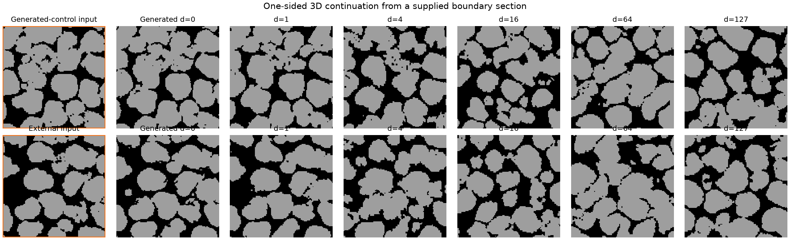
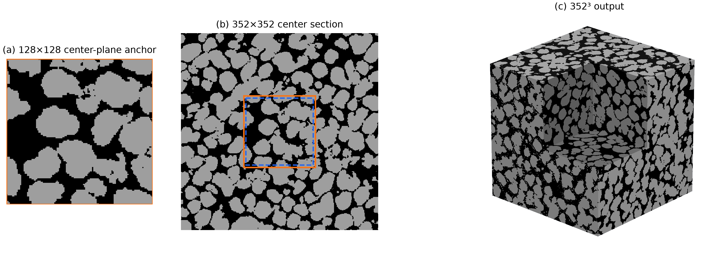

  <h1>Learning 3D Continuation from 2D Sections: Anchor-Conditioned Diffusion for Scalable Microstructure Synthesis</h1>

## Abstract

We present a diffusion-GAN framework that learns three-dimensional categorical microstructures from unregistered two-dimensional sections and accepts a supplied section as a spatial condition. The objective is not to copy the section voxel by voxel, but to generate a compatible 3D realization whose neighboring sections change naturally. A coarse-dominant anchor loss permits boundary adaptation, while a conditional exponential-moving-average (EMA) completion bank supplies aligned three-section relations without imposing a hidden teacher volume as a reconstruction target. At inference, same-noise baseline and anchor trajectories are coupled by the same model-derived Gaussian used for logit guidance, so the condition decays smoothly into ordinary generation. The same 128³ model also generates a 352³ volume through shared-state overlapping blocks. On one binary 226 × 690 training image, direct and scaled samples obtain FID 44.85 ± 2.66 and 35.06 ± 0.61, respectively. Across 12 generated-control internal anchors, conditioning raises pooled anchor similarity from 58.52 ± 2.45% to 92.13 ± 0.65%. For four external boundary-section trials, it raises similarity from 55.16 ± 2.65% to 93.74 ± 0.56%; the 95th-percentile slice flicker is 1.08 ± 0.05 times the same-noise baseline, and the measured farthest-section drift is zero. These are controlled generation results, not experimental 3D reconstruction accuracy; no measured 3D ground truth is available.

## 1. Introduction

Three-dimensional connectivity controls many transport and mechanical properties, but large 3D scans are often harder to obtain than 2D microscopy. Models such as SliceGAN therefore learn a volumetric generator by matching generated sections to available 2D images. This setting is useful for stochastic reconstruction, but it does not by itself answer a conditional question: if a particular section is known, can the model place a similar section at the requested coordinate while preserving a plausible 3D neighborhood?

Hard insertion solves only the first half of that problem. Pasting a measured image into a completed volume guarantees exact labels on one plane but can introduce an abrupt change immediately before and after it. Strong full-resolution supervision creates a similar pressure during learning. We instead treat the supplied section as a prompt for one plausible 3D continuation. Its large-scale morphology should remain recognizable, but local boundaries may move when required by the learned 3D prior.

The available data create a second difficulty: there are no measured 3D trajectories from which to learn section-to-section relations. We use conditional volumes sampled from a frozen EMA model as relation references, while real-data 2D critics remain responsible for marginal appearance. The generated volumes are never used as voxel-wise reconstruction targets.

Our contributions are:

1. a multiscale, mask-normalized plane condition whose loss emphasizes coarse morphology and gives exact pixels only a small weight;
2. a conditional EMA completion bank that separates a measured root section from generated pseudo-planes and transfers aligned local relations rather than a full teacher volume;
3. a same-noise coupled sampler that applies joint multi-anchor guidance in logit space and returns continuously to an unconditioned trajectory with distance; and
4. a shared-state tiled sampler that uses the same fixed-size model to synthesize larger 3D volumes.

We evaluate direct generation, internal anchoring, one-sided generation from a boundary section, and 352³ scale-up. Exact pixel agreement is reported as a secondary diagnostic; the main conditional evidence measures coarse agreement, adjacent-section change, slice flicker, and distance-wise drift.

## 2. Related Work

### 2.1 Reconstruction from 2D observations

Feature-matching and conditional neural methods reconstruct 3D microstructures from a 2D exemplar [1,2]. SliceGAN removes paired 3D supervision by applying 2D discriminators to sections of a generated volume [3]. Diffusion has since been used for 2D microstructure synthesis and 2D-to-3D dimensional expansion [4,5,7]. Property-conditioned approaches control phase fraction or spatial statistics [8,9], while recent volumetrically supervised methods use fixed or sparse observed slices [10,11]. Our setting uses unregistered 2D section collections rather than measured volumetric targets and asks for a plausible conditional realization, not a unique reconstruction.

### 2.2 Conditioning and continuation

Diffusion inpainting preserves observed image regions while generating their missing surroundings [12,13]. An internal material section differs because unknown structure lies on both sides and must remain compatible through the plane. We avoid final overwriting and train a separate relation critic on bounded categorical changes among three consecutive sections. Conditional EMA completions supply candidate relations, but real 2D sections continue to define appearance.

### 2.3 Generation beyond the training size

MultiDiffusion coordinates overlapping diffusion paths [6], Patch-DM collages neighboring features [14], and GrainPaint applies diffusion inpainting to large microstructures [15]. Our scale-up sampler keeps one global categorical diffusion state, fuses clean predictions from fixed-size overlapping 3D blocks at every reverse step, and performs only one posterior update after fusion.

## 3. Method

### 3.1 Problem definition

Let $\mathcal{D}_a$ contain categorical 2D sections normal to axis $a\in\{0,1,2\}$, with labels in $\{0,\ldots,K-1\}$. The sets need not be registered. We learn samples

$$
X\in\{0,\ldots,K-1\}^{D\times H\times W}
$$

whose sections match the corresponding 2D distributions. At inference, an anchor specifies a full plane or dense rectangular region, its normal axis, and its coordinate. Multiple planes and axes may be supplied if labels agree at intersections.

### 3.2 2D-supervised 3D diffusion-GAN

The 3D denoiser $G_\theta(x_{t+1},t,z_t,d,c)$ receives the current categorical diffusion state, time, a newly sampled latent vector, a domain identifier, and optional conditions. It predicts phase logits $\ell_\theta$, decoded as

$$
\hat{x}_0=2\,\mathrm{softmax}(\ell_\theta)-1.
$$

The reverse process follows denoising diffusion GANs [16,17] with ten transitions. The U-Net channel widths are 16, 32, 64, and 64; its condition embedding has 128 channels and its stochastic latent has 64 channels.

Because no paired 3D target exists, an axis-specific 2D critic evaluates section pairs cut from generated volumes against real section pairs. Each critic contains a global and local head. The experiments use one image distribution for all three axes.

### 3.3 Soft multiscale anchor conditioning

Anchor labels $Y$ and mask $M$ form

$$
c_A=(\mathrm{onehot}(Y)\odot M,M).
$$

The condition is projected into the full-resolution encoder feature. At each deeper scale, masked labels and mask coverage are pooled independently; labels are divided by nonzero coverage before a zero-initialized $1\times1\times1$ projection. A thin or partial plane therefore remains visible without treating unobserved zeros as a phase. Zero initialization preserves the original unconditioned mapping at adapter creation.

The anchor objective is

$$
\mathcal{L}_{A}=\mathcal{L}_{\mathrm{pool4}}+0.05\,\mathcal{L}_{\mathrm{pixel}}.
$$

The first term compares mask-normalized $4\times4$ in-plane phase distributions and weights boundary cells by observed coverage. The second term is exact cross-entropy only on the measured root. Generated pseudo-planes receive no full-resolution target. If classifier-free dropout hides an anchor, all anchor-specific losses are disabled for that sample.

### 3.4 Learning relations from conditional EMA completions

After the real single-anchor ramp, a frozen EMA snapshot generates conditional 3D completions rooted in visible measured sections. Each bank entry keeps three objects separate: the raw EMA volume, the measured root, and source coordinates for sampled pseudo-planes. The measured root is overlaid only on a temporary copy used to build a coherent model condition; the raw EMA volume remains unchanged as a relation reference.

Training alternates fresh measured single anchors with multi-plane conditions sampled from one completion. Measured and pseudo-plane coarse losses are normalized separately and averaged, preventing many generated planes from overwhelming the real root. For a pseudo-plane at coordinate $i$, the relation reference is the exact source triplet $(i-1,i,i+1)$ from its completion. A fresh real anchor has no aligned 3D source and therefore uses a morphology-matched fallback triplet.

The relation critic does not see raw section appearance. For three consecutive relaxed categorical sections $(p_{-1},p_0,p_{+1})$, it receives two bounded changes and their bend,

$$
r=(p_0-p_{-1},\;p_{+1}-p_0,\;\tfrac12[(p_{+1}-p_0)-(p_0-p_{-1})]).
$$

This removes the static center image as a direct shortcut. Real 2D pair critics still constrain marginal appearance. Relation batches retain the measured-root window, combine pseudo-plane and general windows across available axes, and periodically refresh the initially fixed EMA completion bank.

The generator loss is

$$
\mathcal{L}_G=\mathcal{L}_{\mathrm{adv}}+r_A(s)(\mathcal{L}_{A}+0.25\mathcal{L}_{\mathrm{rel}}+0.10\mathcal{L}_{\mathrm{transition}})+\mathcal{L}_{\mathrm{vf}},
$$

where $r_A(s)$ is a 500-step anchor ramp. The optional phase-fraction term is part of the shared training model but is not evaluated as a paper contribution here.

### 3.5 Same-noise coupled anchor sampling

At inference, baseline and anchor trajectories begin from identical ordinary noise and share every transition's latent vector and posterior noise. The conditional branch computes one joint multi-anchor logit residual

$$
\Delta\ell=\ell_{\mathrm{anchor}}-\ell_{\mathrm{plain}}.
$$

For distance $d(v,A)$ from the nearest observed anchor support, its spatial weight is

$$
w(v)=s_A\exp\left[-\frac{d(v,A)^2}{2\sigma^2}\right],\qquad \sigma=\sqrt{3}\,f,
$$

where $s_A=0.88$ and $f=8$ is the model downsampling factor. The corrected logits are $\ell_{\mathrm{plain}}+w\Delta\ell$. Exact-plane guidance grows toward the final transition, while surrounding-context guidance decreases with the remaining diffusion noise.

After each posterior update, the normalized Gaussian $w/s_A$ couples the conditional state to the same-noise baseline state. Thus the anchor plane uses the conditional trajectory and distant regions continuously approach the ordinary trajectory without a second hand-chosen coupling radius. No constrained voxel is initialized from the anchor, clamped during denoising, or overwritten after sampling.

### 3.6 Shared-state scale-up

For block size $P=128$ and inward overlap $o$, neighboring starts are separated by $P-2o$. Three blocks per axis with $o=8$ therefore produce

$$
128+2(128-16)=352
$$

voxels per axis. At every reverse transition, all blocks read the same pre-update global state and share one latent vector. Separable cosine windows fuse overlapping clean predictions,

$$
\bar{x}_0(v)=\frac{\sum_k w_k(v)\hat{x}_{0,k}(v)}{\sum_k w_k(v)},
$$

before one global posterior update. A supplied 128³ base is re-noised with one fixed noise field at every transition and blended into the global noisy state with a tapered shell. It remains free to adapt and is never pasted into the final output.

## 4. Experimental Setup

### 4.1 Data and model

The training data consist of one 226 × 690 binary phase map. Phase 0 is treated as pore and phase 1 as solid. Material provenance, acquisition conditions, segmentation history, physical pixel size, and an external data license are unavailable. Results are therefore reported in voxels and interpreted as an algorithmic study. Random 128 × 128 crops supervise all three axes under an isotropy assumption.

  

<em>Figure 1. Binary 2D training image. Orange boxes show example 128 × 128 training crops. Black and gray denote phases 0 and 1.</em>

All reported values use the EMA parameters after 20,000 optimization steps. The generator and critics were initialized from the preceding training stage, whereas the conditional completion bank was constructed anew under the current formulation. Training uses Adam with learning rates of $1.6\times10^{-4}$ for the generator and $10^{-4}$ for the critics, mixed precision, EMA decay 0.999, and real batch size 8.

### 4.2 Evaluation protocols

Structural evaluation uses seeds 0–3. Direct samples are 128³. Scale-up samples use a 3 × 3 × 3 block plan, eight-voxel inward overlap, no outer margin, and no supplied base, isolating the tiled sampler. FID compares 64 random axis-0 generated sections with 64 random real crops at the same 128² field of view.

Conditional evaluation has three groups. Generated-control internal anchors use four unconditioned references, all three center axes, and therefore 12 cases. Generated-control boundary anchors use the first axis-0 section of those references in four cases. External boundary tests use the fixed 128² crop at $(\mathrm{left},\mathrm{top})=(281,58)$ from the real image with four sampling seeds. Every conditioned sample is compared with an unconditioned trajectory that shares its initial noise, per-step latent vectors, and posterior noise.

The qualitative internal and scale-up examples use seed 0 and the same external crop. The 352³ illustrated scale-up receives an anchored 128³ base; the quantitative scale-up row does not, keeping the structural comparison separate from anchor retention.

### 4.3 Metrics

- **FID:** Inception-v3 feature distance between real and generated 2D sections [19]. It is a relative image-distribution measure, not a material-specific perceptual score.
- **Phase-0 fraction:** fraction of labels assigned to phase 0.
- **Interface density:** mean fraction of adjacent locations with different labels, over two axes for real crops and three axes for generated volumes.
- **Tortuosity:** TauFactor 1.2.1 phase-0 diffusive tortuosity along axis 0, with convergence criterion $10^{-3}$ [18].
- **Percolation:** mean fraction of phase-0 voxels in non-periodic, 6-connected components spanning each of the three axes.
- **Pool4 similarity:** one minus the mean total-variation distance between categorical phase distributions in corresponding 4 × 4 cells of the supplied and generated plane. The same-noise unconditioned value measures how much agreement existed before conditioning.
- **First-change ratio:** phase-change rate adjacent to the anchor divided by the ordinary adjacent-section change rate in the same volume.
- **Flicker ratio:** 95th percentile or maximum of the absolute second difference of adjacent-section change rates, divided by the same-noise unconditioned baseline.
- **Farthest drift:** label disagreement with the same-noise baseline at the farthest section represented in that protocol.

Tables report mean ± sample standard deviation. Exact anchor pixel accuracy is included only as a secondary diagnostic.

## 5. Results

### 5.1 Direct and scalable 3D synthesis

The direct samples preserve approximately the feature scale and interface density of the real sections (Figures 2 and 3). Table 1 shows that the 352³ sampler maintains phase fraction, interface density, tortuosity, and percolation close to direct 128³ generation. Scale-up FID is lower, but this should not be interpreted as a definitive quality ranking: a larger volume supplies more spatially varied candidate crops to the same 2D metric.

| Evaluation data | FID ↓ | Phase-0 fraction | Interface density | Tortuosity axis 0 | Percolation phase 0 |
|---|---:|---:|---:|---:|---:|
| Real 2D crops | 19.51 ± 1.14 | 0.3625 ± 0.0042 | 0.06332 ± 0.00035 | — | — |
| Direct 128³ | 44.85 ± 2.66 | 0.3399 ± 0.0025 | 0.06656 ± 0.00022 | 2.050 ± 0.022 | 99.734 ± 0.035% |
| Scale-up 352³ | 35.06 ± 0.61 | 0.3440 ± 0.0006 | 0.06577 ± 0.00037 | 2.003 ± 0.024 | 99.729 ± 0.016% |

<em>Figure 2. Unconditioned 128³ seed-0 sample with one octant removed.</em>

<em>Figure 3. Orthogonal center sections of the volume in Figure 2.</em>

### 5.2 Internal plane conditioning

Across 12 generated-control internal conditions, pool4 similarity rises by 33.60 ± 2.45 percentage points to 92.13 ± 0.65% (Table 2). Adjacent-section change remains close to ordinary generation, while the qualitative external center-plane result obtains 92.44% exact agreement without final replacement (Figure 4).

<em>Figure 4. External center-plane conditioning. The supplied section, generated section at the requested coordinate, and surrounding 128³ realization are shown separately.</em>

### 5.3 One-sided continuation from a boundary section

Placing the section at index 0 turns the experiment into one-sided spatial continuation: the model must produce all remaining sections on one side of the observation. Pool4 similarity reaches 93.71 ± 0.68% for generated-control inputs and 93.74 ± 0.56% for the external image (Table 2). The external boundary does not create a larger immediate jump than ordinary generated sections, although peak flicker still reveals occasional visual stutter.

| Condition | Cases | Unconditioned pool4 | Conditioned pool4 ↑ | Gain | First change / ordinary | p95 flicker / baseline | Peak flicker / baseline | Farthest drift ↓ |
|---|---:|---:|---:|---:|---:|---:|---:|---:|
| Generated-control internal | 12 | 58.52 ± 2.45% | 92.13 ± 0.65% | +33.60 ± 2.45 pp | 1.12 ± 0.15 | 1.20 ± 0.19 | 1.74 ± 0.63 | 0.00% |
| Generated-control boundary | 4 | 59.47 ± 2.11% | 93.71 ± 0.68% | +34.24 ± 2.54 pp | 0.90 ± 0.08 | 1.12 ± 0.10 | 1.64 ± 0.51 | 0.00% |
| External boundary | 4 | 55.16 ± 2.65% | 93.74 ± 0.56% | +38.58 ± 2.32 pp | 0.85 ± 0.12 | 1.08 ± 0.05 | 1.37 ± 0.32 | 0.00% |

<em>Figure 5. One-sided continuation. Top: a section drawn from an unconditioned reference. Bottom: a real external crop. The input and generated d=0 plane are shown separately, followed by sections at increasing distance. These are possible stochastic continuations, not predictions of a unique measured 3D volume.</em>

The zero farthest drift in Table 2 is observed at distance 64 for internal center-plane tests and distance 127 for boundary tests. It is not caused by final output copying; the Gaussian guidance becomes numerically negligible and the coupled trajectory returns to the same-noise baseline.

### 5.4 Anchored scale-up

The fixed-block sampler produces 352³ voxels with 27 fixed-size tiles at each reverse transition (Figure 6), 20.80 times the voxel count of a direct sample. In the illustrated result, the external center anchor retains 91.66% exact agreement after scale-up. Table 1 shows that global morphology and transport summaries remain close to direct generation.

<em>Figure 6. Scale-up with 3 × 3 × 3 fixed 128³ blocks. The orange box marks the base footprint and the blue dashed box its full-strength interior. Neither the anchor nor the base is pasted into the final 352³ result.</em>

## 6. Discussion

The experiments support a narrower claim than deterministic 2D-to-3D reconstruction. A measured section constrains one stochastic realization, and the model uses learned relations to continue away from it. The condition remains recognizable without hard clamping, while first-change and p95 flicker results indicate that this flexibility generally avoids a new seam at the plane.

The generated-control experiment isolates conditional behavior within the model's own distribution, whereas the external experiment tests the intended use case. Their similar boundary metrics suggest that the real 2D critics and soft anchor objective prevent the conditional EMA prior from simply imposing its own center-image style. Physical reconstruction accuracy nevertheless requires measured 3D data.

The maximum flicker ratios reveal the remaining failure more clearly than mean metrics. Most transitions are close to baseline, but occasional locations still change faster. This agrees with visual inspection of a slight lag-like motion and motivates future work on longer-range relation critics or sequence-level evaluation rather than stronger pixel copying.

Scale-up preserves the reported aggregate statistics while expanding the field of view. Because all blocks share one state and exchange predictions at every step, no post-hoc seam correction is required. The anchored base can still differ locally from its input, which is necessary for compatibility with the larger realization.

## 7. Limitations

The study uses one binary image, no held-out specimen, and no experimental 3D volume. The generated-control anchors come from the model itself and therefore cannot measure out-of-distribution reconstruction. The external anchor comes from the same source image used for training. Material provenance, physical scale, and acquisition variability are unknown.

The relation reference is a model-generated conditional completion, not measured 3D truth. Separating relation changes from appearance and retaining real 2D critics reduces but cannot eliminate self-reference. No independently trained ablation isolates every component of the current anchor system, so the results establish integrated-system behavior rather than causal contribution sizes.

FID uses a natural-image network, percolation is a coarse global spanning fraction, and tortuosity is evaluated only along axis 0. Four seeds characterize stochastic variation only approximately. The nonzero peak-flicker ratios show that occasional abrupt changes remain even when p95 behavior is close to baseline.

## 8. Conclusion

The method learns 3D microstructure generation from 2D sections, uses a supplied plane as a soft spatial condition, and scales the same model to larger volumes. Its defining choice is to transfer section relationships from conditional EMA completions without copying a teacher volume or overwriting final voxels. The results support conditional stochastic synthesis with near-baseline local continuity and stable scale-up statistics; experimental 3D validation remains necessary.

## References

[1] R. Bostanabad, “Reconstruction of 3D microstructures from 2D images via transfer learning,” *Computer-Aided Design*, vol. 128, art. 102906, 2020.

[2] J. Feng, Q. Teng, B. Li, X. He, H. Chen, and Y. Li, “An end-to-end three-dimensional reconstruction framework of porous media from a single two-dimensional image based on deep learning,” *Computer Methods in Applied Mechanics and Engineering*, vol. 368, art. 113043, 2020.

[3] S. Kench and S. J. Cooper, “Generating three-dimensional structures from a two-dimensional slice with generative adversarial network-based dimensionality expansion,” *Nature Machine Intelligence*, vol. 3, pp. 299–305, 2021.

[4] J. Phan et al., “Generating 3D images of material microstructures from a single 2D image: a denoising diffusion approach,” *Scientific Reports*, vol. 14, art. 6498, 2024.

[5] K.-H. Lee and G. J. Yun, “Multi-plane denoising diffusion-based dimensionality expansion for 2D-to-3D reconstruction of microstructures with harmonized sampling,” *npj Computational Materials*, vol. 10, art. 99, 2024.

[6] O. Bar-Tal, L. Yariv, Y. Lipman, and T. Dekel, “MultiDiffusion: Fusing diffusion paths for controlled image generation,” in *Proceedings of the 40th International Conference on Machine Learning*, vol. 202, pp. 1737–1752, 2023.

[7] C. Düreth, P. Seibert, D. Rücker, S. Handford, M. Kästner, and M. Gude, “Conditional diffusion-based microstructure reconstruction,” *Materials Today Communications*, vol. 35, art. 105608, 2023.

[8] A. Sadeghkhani, B. Bennett, and A. Rabbani, “Property-constrained 3D porous media reconstruction from 2D images via conditional generative adversarial networks,” in *87th EAGE Annual Conference & Exhibition*, vol. 2026, pp. 1–5, 2026.

[9] Z. Ma et al., “A sliced-Wasserstein and neural network framework for statistically controllable 3D microstructure reconstruction,” *Computer-Aided Design*, vol. 198, art. 104100, 2026.

[10] S. Fan, Y. Li, X. Wang, and D. Du, “Dual-domain latent diffusion framework with multi-modal conditioning for controllable porous media reconstruction,” *Computational Materials Science*, vol. 272, art. 114876, 2026.

[11] Y. Shi et al., “GeoTopoDiff: Learning geometry–topology graph priors through boundary-constrained mixed diffusion for sparse-slice 3D porous reconstruction,” *arXiv preprint* arXiv:2605.03764, 2026.

[12] G. Zhang et al., “Towards coherent image inpainting using denoising diffusion implicit models,” in *Proceedings of the 40th International Conference on Machine Learning*, pp. 41164–41193, 2023.

[13] A. Lugmayr et al., “RePaint: Inpainting using denoising diffusion probabilistic models,” in *Proceedings of the IEEE/CVF Conference on Computer Vision and Pattern Recognition*, pp. 11461–11471, 2022.

[14] Z. Ding, M. Zhang, J. Wu, and Z. Tu, “Patched denoising diffusion models for high-resolution image synthesis,” in *International Conference on Learning Representations*, 2024.

[15] N. Hoffman, C. Diniz, D. Liu, T. M. Rodgers, A. Tran, and M. D. Fuge, “GrainPaint: A multi-scale diffusion-based generative model for microstructure reconstruction of large-scale objects,” *Acta Materialia*, vol. 288, art. 120784, 2025.

[16] J. Ho, A. Jain, and P. Abbeel, “Denoising diffusion probabilistic models,” in *Advances in Neural Information Processing Systems*, vol. 33, pp. 6840–6851, 2020.

[17] Z. Xiao, K. Kreis, and A. Vahdat, “Tackling the generative learning trilemma with denoising diffusion GANs,” in *International Conference on Learning Representations*, 2022.

[18] S. J. Cooper, A. Bertei, P. R. Shearing, J. A. Kilner, and N. P. Brandon, “TauFactor: An open-source application for calculating tortuosity factors from tomographic data,” *SoftwareX*, vol. 5, pp. 203–210, 2016.

[19] M. Heusel, H. Ramsauer, T. Unterthiner, B. Nessler, and S. Hochreiter, “GANs trained by a two time-scale update rule converge to a Nash equilibrium,” in *Advances in Neural Information Processing Systems*, vol. 30, 2017.
