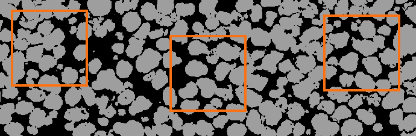
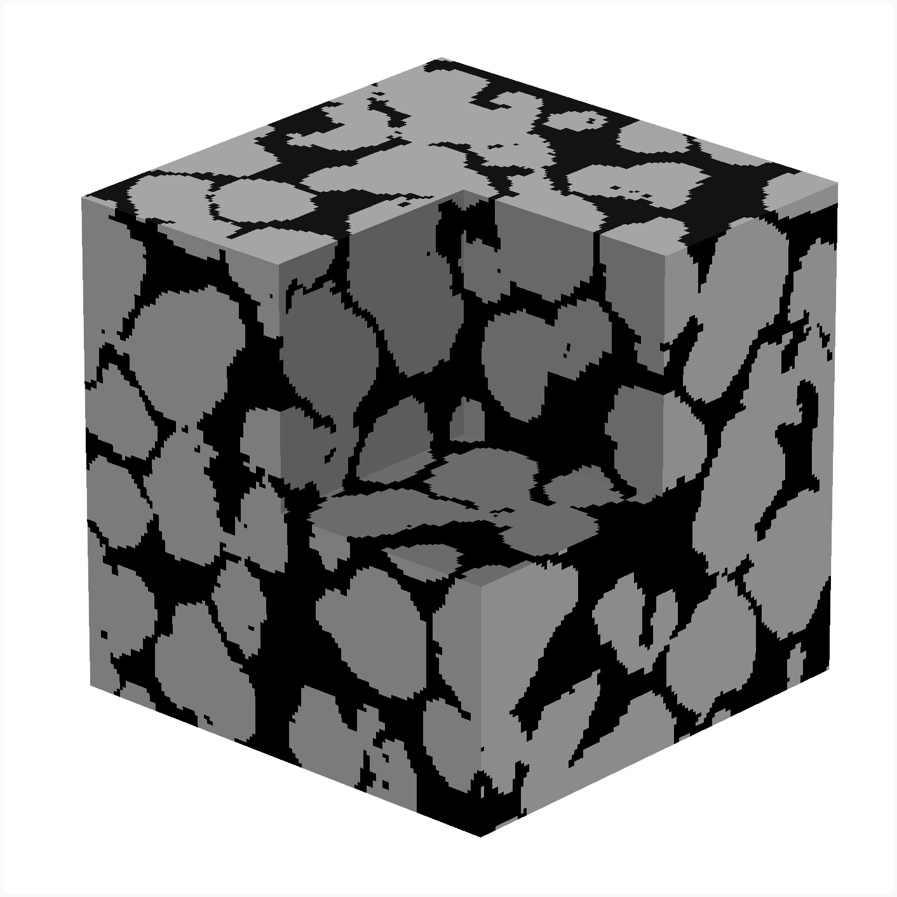

# Diffusion-GAN 3D

Generate 3D microstructures from **2D label images**, without measured 3D training targets.
Learn the appearance of real sections, guide generation with known planes,
and build larger or higher-resolution volumes.

[Quick start](#quick-start) · [Run and inspect](docs/checks.md) · [Development](docs/development.md) · [Method & experiments](PAPER.md)

| 2D training image and example crops | Generated 3D volume |
| :---: | :---: |
|  |  |

Examples from the [recorded experiments](PAPER.md); their settings differ from current defaults.

- **2D → 3D:** train from categorical sections in the `xy`, `xz`, and `yz` planes.
- **Plane conditions:** guide generation with known sections, called anchors.
- **Larger outputs:** combine overlapping tiles; refine with a separate super-resolution model.

## Quick start

Use Python 3.11+ and a PyTorch build suited to your CUDA environment.
Run commands from the project root in the activated environment.

```bash
git clone https://github.com/phykn/diffusion-gan3d.git
cd diffusion-gan3d
python -m venv .venv
# Activate: source .venv/bin/activate (Linux/macOS)
# PowerShell: .\.venv\Scripts\Activate.ps1
python -m pip install -r requirements.txt
```

The default data preset includes `data/sample.png`. To use your own images, edit
[config/data/default.yaml](config/data/default.yaml): each input must be a single
2D uint8 frame containing phase IDs from `0` to `num_phases - 1`.
`crop_size` is measured in source pixels; `lo_res_size` and `hi_res_size` are voxel grid sizes.

```bash
python scripts/01_check_dataset.py --no-view
python run_train_1st.py --run-dir "run/my-lr-run" --device cuda
python scripts/02_check_generated.py --weight "run/my-lr-run" --no-view
```

Use a new `--run-dir` for each training run, then pass that directory to `--weight`.
The [LR (low-resolution) preset](config/train/low_res.yaml) controls training; weights and resolved settings
are saved in the run directory, and inspection images/TIFF volumes in `run/checks/`.
Use `--device cpu` for training or generation without CUDA.

## Super-resolution (optional)

Stage 2 trains a separate model using frozen stage-1 volumes and real high-resolution sections.
Configure the [SR preset](config/train/sr.yaml), then run:

```bash
python run_train_2nd.py --base-weights "run/my-lr-run" --run-dir "run/my-sr-run" --device cuda
python scripts/06_check_hr.py --weight "run/my-sr-run" --no-view
```

## Web interface

Use an LR run. Start the backend, then the frontend in another terminal (Node.js required):

```bash
python backend/run.py --weight "run/my-lr-run"
```

```bash
cd frontend
npm ci
npm run dev
```

Open the URL printed by Vite to select a section, crop an anchor, and generate a volume.
[backend/config.yaml](backend/config.yaml) controls HTTP resource limits.

## Working with the code

- Training starts at [run_train_1st.py](run_train_1st.py) and [run_train_2nd.py](run_train_2nd.py).
- Python generation starts at [src/api.py](src/api.py): `LowResolutionAPI`, `PlaneAnchor`, and `SuperResolutionAPI`.
- See the [code map and checks](docs/development.md) for implementation locations and test commands.
- See [run and inspection notes](docs/checks.md) for anchors, tiled generation, saved outputs, and resume.

Current behavior is defined by the code and presets; [PAPER.md](PAPER.md) records specific experiments.
Generated volumes are plausible samples, not measurements of an unknown 3D specimen.

[MIT License](LICENSE)
