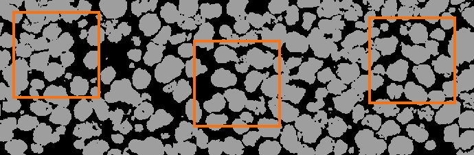
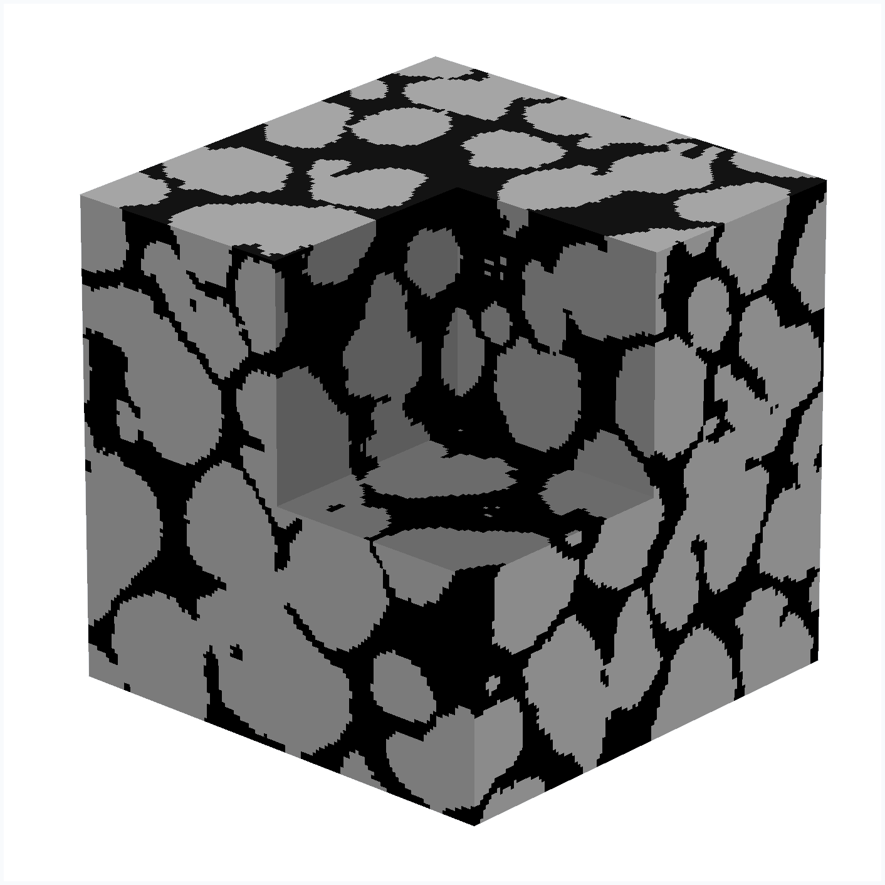

# Diffusion-GAN 3D

Generate 3D microstructures from **2D label images**, without measured 3D training targets.
Learn the appearance of real sections, guide generation with known planes,
and build larger or higher-resolution volumes.

[Install](#install) · [Run and inspect](scripts/README.md) · [Method & experiments](paper/README.md)

| 2D training image and example crops | Generated HR volume (128³) |
| :---: | :---: |
|  |  |

The volume is an LR sample refined by the SR stage of the run described in [the paper](paper/README.md),
with the default sample's settings; one voxel spans one source pixel.

- **2D → 3D:** train from categorical sections in the `xy`, `xz`, and `yz` planes.
- **Plane anchors:** steer generation toward known sections by posterior sampling.
- **Larger outputs:** combine overlapping tiles; refine with a separate super-resolution model.

## Install

Use Python 3.11+. Install the [PyTorch build](https://pytorch.org/get-started/locally/) for
your GPU (CUDA or Apple MPS) or CPU first, then the rest:

```bash
git clone https://github.com/phykn/diffusion-gan3d.git
cd diffusion-gan3d
python -m venv .venv
source .venv/bin/activate   # PowerShell: .\.venv\Scripts\Activate.ps1
python -m pip install -r requirements.txt
```

## Train

Training has two stages. The **LR** (low-resolution) model generates volumes from noise
at `lo_res_size` voxels per `crop_size` source pixels (64 per 128 in the default sample).
The **SR** (super-resolution) model then refines LR volumes `sr_scale` times finer
(64 to 128 voxels in the default sample).

```bash
python scripts/check/01_dataset.py --sample default --no-view
python train.py default --run-dir "run/my-run"
python scripts/check/02_generated.py --weight "run/my-run-lr" --no-view
python scripts/check/06_hr.py --weight "run/my-run-sr" --no-view
```

`train.py` trains LR, then SR from frozen LR volumes. `--run-dir NAME` writes `NAME-lr`
and `NAME-sr` and skips a finished stage on rerun; without it, each stage gets a new dated
folder under `run/`. `--lr-only` stops after LR. `--steps` and `--sr-steps` set the LR and
SR totals (10000 and 5000 by default), and `--bank-size` the frozen LR volumes per domain
that SR trains on (8). Each stage's `generator.pt` is its best scored step, not the last
one. Burn-in, devices, and memory options are in
[Training options](scripts/README.md#training-options); resume is in
[Save and resume](scripts/README.md#save-and-resume).

### Samples

A sample is one file in [config/samples/](config/samples/); copy
[default.yaml](config/samples/default.yaml) to add one. It names folders of 2D uint8 label
images for the `xy`, `xz`, and `yz` planes (phases `0..K-1`, phase 0 pore), the crop and
voxel sizes, what the material looks like, and single settings to change per stage. Each
field is described in [Sample fields](scripts/README.md#sample-fields).

## Web interface

Start the backend with an SR run, then the frontend in another terminal (Node.js 20.19+ or 22.12+):

```bash
python app/backend/run.py --weight "run/my-run-sr"
```

Each request generates an LR volume with the SR run's LR run (`--lr-weight` picks another)
and refines it.

```bash
cd app/frontend
npm ci
npm run dev
```

Open the URL Vite prints (`API_URL=http://HOST:PORT` for another backend). After
`npm run build`, a restarted backend serves the page itself at http://127.0.0.1:8000
(`--host` and `--port` change it).

## Python API

[src/api.py](src/api.py) provides `LowResolutionAPI`, `PlaneAnchor`, `SuperResolutionAPI`,
and `extend_hr`. Volumes are `(z, y, x)`.

```python
from src.api import LowResolutionAPI, SuperResolutionAPI

lr = LowResolutionAPI("run/my-run-lr")  # a run directory or its generator.pt
labels = lr.generate(shape=(96, 64, 64), seed=1)  # uint8 phase labels
sr = SuperResolutionAPI("run/my-run-sr")
high = sr.refine(labels, seed=1, tile_size=128)  # (192, 128, 128) at the default 2x
```

`generate` takes unset guidance, anchor strength, and overlap from
[config/gen.yaml](config/gen.yaml); `anchors=[PlaneAnchor(labels, axis, index)]` steers it
toward a known 2D section at `index` along `axis` (0, 1, 2 for `xy`, `xz`, `yz`).
`refine` uses guidance 1.0 and refines in one block unless `tile_size` is given;
`sr.default_tiling()` returns a run's SR training size (128 for the default sample), and an
unset `overlap` is scale-aligned to the tile. `extend_hr` grows a larger HR volume around
an existing one. `generate_probs` and `refine_probs` return phase fractions
instead of labels and take the same options; `seed=None` leaves the RNG unseeded.

Generated volumes are plausible samples, not measurements of an unknown 3D specimen.

[MIT License](LICENSE)
